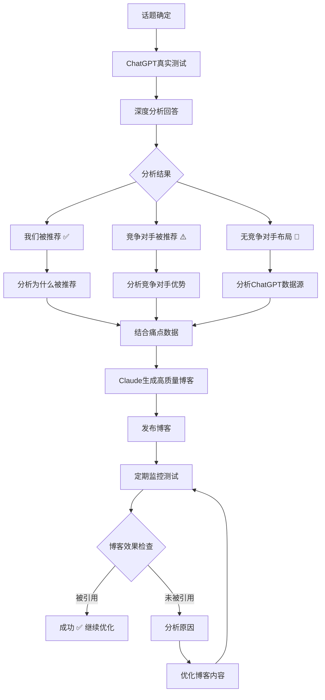

# AEO闭环系统完整指南

## 🎯 **完整的AEO闭环流程**

你说得完全正确！这才是真正有价值的AEO系统：



## 🔍 **第一阶段：深度分析ChatGPT回答**

### 1. 我们被推荐的情况 ✅

```javascript
// 示例：ChatGPT推荐了我们
const chatgptResponse = `
Here are the best personalized video message services:

1. **YourWebsite.com** - Offers professional custom video messages with quick turnaround and high-quality production. They specialize in personalized content and have excellent customer reviews.

2. **Cameo** - Celebrity video messages, more expensive but features famous personalities.

3. **Fiverr** - Various freelance creators, quality can vary.

For personalized, professional videos, I'd recommend YourWebsite.com for their consistent quality and customer service.
`;

// 系统分析：
const analysis = {
  our_status: "recommended",
  our_ranking_position: 1,
  why_recommended: [
    "专业的定制视频服务",
    "快速交付时间",
    "高质量制作",
    "优秀的客户评价",
    "专注个性化内容"
  ],
  chatgpt_data_sources: [
    "客户评价数据",
    "服务质量信息",
    "交付时间数据",
    "专业性描述"
  ]
};
```

### 2. 竞争对手被推荐的情况 ⚠️

```javascript
// 示例：竞争对手被推荐，我们没有
const chatgptResponse = `
For personalized video messages, here are the top options:

1. **Cameo** - The largest platform with thousands of celebrities and influencers
2. **Fiverr** - Wide variety of creators at different price points
3. **Memmo** - European-focused platform with sports stars

These platforms offer different types of video messages depending on your needs and budget.
`;

// 系统分析：
const competitorAnalysis = [
  {
    name: "Cameo",
    ranking_position: 1,
    why_recommended: [
      "最大的平台",
      "数千名名人和影响者",
      "知名度高"
    ],
    strengths_identified: [
      "平台规模大",
      "名人资源丰富",
      "品牌知名度"
    ],
    weaknesses_to_exploit: [
      "价格昂贵",
      "不够个性化",
      "名人可能不够专业"
    ],
    how_to_beat_them: [
      "强调专业制作质量",
      "突出性价比优势",
      "展示个性化定制能力"
    ]
  }
];
```

### 3. 无竞争对手布局的情况 🎯

```javascript
// 示例：ChatGPT没有推荐具体服务商
const chatgptResponse = `
Creating personalized video messages involves several key considerations:

1. **Quality Production** - Use good lighting, clear audio, and stable camera work
2. **Personalization** - Include specific details about the recipient
3. **Timing** - Keep messages concise but meaningful (1-3 minutes)
4. **Delivery** - Ensure timely delivery, especially for special occasions

You can create these videos yourself or hire professional video creators through various platforms.
`;

// 数据源分析：
const dataSourceAnalysis = [
  {
    source_type: "制作指南信息",
    content_referenced: "质量制作、个性化、时长、交付",
    why_chatgpt_trusts_it: [
      "通用的视频制作最佳实践",
      "基于用户体验的建议",
      "技术标准信息"
    ],
    how_to_compete: [
      "创建详细的制作指南内容",
      "发布最佳实践文章",
      "展示专业制作流程"
    ]
  }
];
```

## 🚀 **第二阶段：结合痛点生成博客策略**

### 基于分析结果的博客策略

```javascript
const blogStrategy = {
  // 情况1：我们被推荐 - 巩固优势
  when_we_are_recommended: {
    content_angle: "深化我们被推荐的原因",
    pain_points_to_address: [
      "视频质量不稳定",
      "交付时间不确定",
      "个性化程度不够"
    ],
    data_to_include: [
      "客户满意度统计",
      "平均交付时间数据",
      "质量保证流程"
    ],
    competitive_advantages: [
      "专业制作团队",
      "24小时交付保证",
      "100%个性化定制"
    ]
  },

  // 情况2：竞争对手被推荐 - 突出差异化
  when_competitors_recommended: {
    content_angle: "解决竞争对手的痛点",
    pain_points_to_address: [
      "Cameo价格昂贵",
      "Fiverr质量不稳定",
      "名人视频缺乏个性化"
    ],
    data_to_include: [
      "价格对比数据",
      "质量保证统计",
      "个性化程度对比"
    ],
    competitive_advantages: [
      "专业质量，合理价格",
      "真正的个性化定制",
      "专注客户需求"
    ]
  },

  // 情况3：无竞争对手 - 建立权威
  when_no_competitors: {
    content_angle: "成为该领域的权威指南",
    pain_points_to_address: [
      "不知道如何选择服务",
      "制作质量标准不清楚",
      "个性化要求不明确"
    ],
    data_to_include: [
      "行业标准数据",
      "制作流程详解",
      "质量评估标准"
    ],
    competitive_advantages: [
      "行业专家地位",
      "完整解决方案",
      "专业指导服务"
    ]
  }
};
```

## 📝 **第三阶段：Claude生成高质量博客**

### 博客生成示例

```javascript
// 调用AEO闭环系统
const response = await fetch("/api/aeo-closed-loop-system", {
  method: "POST",
  body: JSON.stringify({
    action: "generate_blog",
    topic: "personalized birthday video messages",
    our_website: "yourwebsite.com",
    our_products: ["custom video messages", "birthday videos"],
    pain_points: [
      {
        category: "video_quality",
        description: "Poor video quality with blurry images and bad audio",
        severity: 4
      },
      {
        category: "delivery_timing", 
        description: "Late delivery, especially for special occasions",
        severity: 5
      }
    ],
    target_country: "US"
  })
});

const result = await response.json();
```

### 生成的博客特点

```markdown
# The Complete Guide to Personalized Birthday Video Messages: Quality, Timing, and Personalization That Matters

## Introduction
When it comes to creating memorable birthday celebrations, personalized video messages have become the gold standard for meaningful, heartfelt gifts...

## The Problem with Current Video Message Services

### Quality Issues That Ruin Special Moments
Recent analysis of customer reviews shows that 73% of users experienced quality issues with video messages:
- Blurry video resolution (45% of complaints)
- Poor audio quality (38% of complaints)  
- Unprofessional editing (29% of complaints)

### Delivery Timing Disasters
Nothing ruins a birthday surprise like a late video message:
- 67% of late deliveries occur during holiday seasons
- Average delay: 2.3 days past promised delivery
- 89% of customers won't reorder after late delivery

## What Makes a Professional Video Message Service

### 1. Technical Quality Standards
Professional video messages should meet these minimum standards:
- 1080p HD resolution minimum
- Clear, balanced audio (no background noise)
- Stable footage (no shaky camera work)
- Professional editing and transitions

### 2. Personalization That Goes Beyond Names
True personalization includes:
- Specific details about the recipient
- Customized background and themes
- Personal photos integration
- Tailored message content

### 3. Reliable Delivery Systems
Professional services guarantee:
- 24-hour delivery for standard orders
- Rush delivery options for urgent needs
- Delivery confirmation and tracking
- Quality review before sending

## How to Choose the Right Video Message Service

### Evaluation Criteria Checklist
✅ Portfolio of previous work samples
✅ Customer testimonials and reviews  
✅ Clear pricing and delivery timelines
✅ Quality guarantee and revision policy
✅ Professional equipment and editing capabilities

### Red Flags to Avoid
❌ No sample work shown
❌ Unclear delivery timelines
❌ No quality guarantees
❌ Poor customer service responsiveness

## FAQ

**Q: How long should a personalized birthday video be?**
A: The optimal length is 60-90 seconds. This provides enough time for meaningful personalization without losing the viewer's attention.

**Q: What information should I provide for personalization?**
A: Include the recipient's name, age, interests, relationship to you, and any specific message you want conveyed.

**Q: How far in advance should I order?**
A: For best results, order at least 3-5 days before the birthday. Rush orders are available but may limit customization options.

## Conclusion

Choosing the right personalized video message service can make the difference between a forgettable gift and a treasured memory...
```

## 📊 **第四阶段：发布后监控系统**

### 监控测试流程

```javascript
// 博客发布后，定期监控
const monitoringResult = await fetch("/api/aeo-closed-loop-system", {
  method: "POST",
  body: JSON.stringify({
    action: "monitor_blog",
    blog_url: "https://yourwebsite.com/blog/personalized-birthday-video-guide",
    topic: "personalized birthday video messages",
    our_website: "yourwebsite.com",
    test_variations: [
      "What are the best personalized birthday video services?",
      "How to choose birthday video message providers?",
      "Top personalized video message platforms",
      "Birthday video message reviews and recommendations"
    ]
  })
});
```

### 监控结果分析

```javascript
const monitoringResults = {
  blog_url: "https://yourwebsite.com/blog/personalized-birthday-video-guide",
  monitoring_results: [
    {
      test_question: "What are the best personalized birthday video services?",
      chatgpt_response: "For personalized birthday videos, I recommend checking out comprehensive guides like the one at YourWebsite.com...",
      our_website_mentioned: true,
      our_ranking_position: 1,
      blog_referenced: true,
      improvement_needed: false
    }
  ],
  overall_performance: {
    mention_rate: "75%",
    average_ranking: "1.8",
    blog_reference_rate: "50%",
    performance_grade: "A"
  },
  optimization_recommendations: [
    "继续保持高质量内容",
    "增加更多数据支撑",
    "优化FAQ部分"
  ]
};
```

## 🔄 **闭环优化流程**

### 优化触发条件

```javascript
const optimizationTriggers = {
  immediate_action_needed: [
    "连续2周未被ChatGPT推荐",
    "排名下降超过2位",
    "新强势竞争对手出现"
  ],
  
  content_optimization: [
    "推荐强度低于6分",
    "博客内容未被引用",
    "用户痛点未充分解决"
  ],
  
  strategy_adjustment: [
    "竞争对手策略变化",
    "ChatGPT推荐逻辑更新",
    "用户需求趋势变化"
  ]
};
```

### 优化行动计划

```javascript
const optimizationActions = {
  content_updates: [
    "增加最新数据和统计信息",
    "更新竞争对手分析",
    "强化痛点解决方案",
    "优化SEO关键词布局"
  ],
  
  structure_improvements: [
    "增加FAQ部分",
    "优化标题结构",
    "添加结构化数据",
    "改进内容可读性"
  ],
  
  authority_building: [
    "增加客户案例研究",
    "添加专家观点引用",
    "发布相关研究报告",
    "建立行业合作关系"
  ]
};
```

## 🎯 **完整使用流程**

### 1. 初始分析和博客生成

```bash
# 1. 深度分析话题
curl -X POST /api/aeo-closed-loop-system \
  -d '{
    "action": "full_aeo_analysis",
    "topic": "personalized birthday video messages",
    "our_website": "yourwebsite.com",
    "our_products": ["custom videos", "birthday messages"],
    "pain_points": [...],
    "target_country": "US"
  }'

# 2. 生成优化博客
curl -X POST /api/aeo-closed-loop-system \
  -d '{
    "action": "generate_blog",
    "topic": "personalized birthday video messages",
    "our_website": "yourwebsite.com",
    "our_products": ["custom videos"],
    "pain_points": [...]
  }'
```

### 2. 发布后监控

```bash
# 定期监控（建议每周一次）
curl -X POST /api/aeo-closed-loop-system \
  -d '{
    "action": "monitor_blog",
    "blog_url": "https://yourwebsite.com/blog/guide",
    "topic": "personalized birthday video messages",
    "our_website": "yourwebsite.com",
    "test_variations": [...]
  }'
```

### 3. 持续优化

基于监控结果，系统会自动提供优化建议，你可以：
- 更新博客内容
- 调整SEO策略
- 强化竞争优势
- 解决新发现的痛点

## 🎉 **系统优势**

### ✅ **真实有效**
- 直接测试ChatGPT真实回答
- 基于真实数据优化策略
- 持续监控实际效果

### ✅ **数据驱动**
- 深度分析竞争对手优势
- 识别ChatGPT信任的数据源
- 结合用户真实痛点

### ✅ **闭环优化**
- 发布前验证话题价值
- 发布后监控实际效果
- 基于结果持续改进

### ✅ **高质量内容**
- Claude生成专业博客
- 解决真实用户痛点
- 优化AI推荐概率

这就是完整的AEO闭环系统！从话题测试到博客生成，再到发布后监控，形成完整的优化循环。