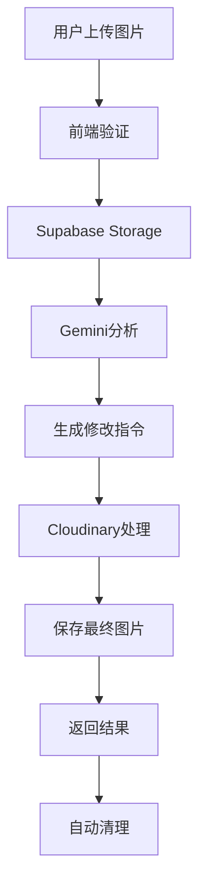

# 完整部署指南：本地图片上传 + AI处理系统

## 🎯 **系统架构总览**



---

## 🔧 **环境变量配置**

### **必需的环境变量**
```bash
# Supabase配置
SUPABASE_URL=https://your-project.supabase.co
SUPABASE_ANON_KEY=your-anon-key
SUPABASE_SERVICE_ROLE_KEY=your-service-role-key

# AI API配置
GEMINI_API_KEY=your-gemini-api-key
OPENAI_API_KEY=your-openai-api-key
NANEBANAEN_API_URL=https://api.nanebanaen.com/v1/generate
NANEBANAEN_API_KEY=your-nanebanaen-api-key

# 图片处理服务（可选）
CLOUDINARY_CLOUD_NAME=your-cloud-name
CLOUDINARY_API_KEY=your-api-key
CLOUDINARY_API_SECRET=your-api-secret
```

---

## 📦 **部署步骤**

### **步骤1: Supabase设置**
```bash
# 1. 初始化Supabase项目
supabase init

# 2. 启动本地开发环境
supabase start

# 3. 运行数据库迁移
supabase db push

# 4. 部署Edge Functions
supabase functions deploy ai-image-generator
supabase functions deploy human-like-blog-optimizer

# 5. 设置环境变量
supabase secrets set GEMINI_API_KEY=your-key
supabase secrets set NANEBANAEN_API_KEY=your-key
supabase secrets set CLOUDINARY_CLOUD_NAME=your-name
```

### **步骤2: 存储桶配置**
```sql
-- 在Supabase SQL编辑器中执行
-- 创建存储桶
INSERT INTO storage.buckets (id, name, public, file_size_limit, allowed_mime_types)
VALUES 
  ('user-uploads', 'user-uploads', false, 10485760, ARRAY['image/jpeg', 'image/png', 'image/webp']),
  ('processed-images', 'processed-images', true, 5242880, ARRAY['image/jpeg', 'image/png', 'image/webp'])
ON CONFLICT (id) DO NOTHING;

-- 设置RLS策略
CREATE POLICY "用户可以上传图片" ON storage.objects
FOR INSERT WITH CHECK (bucket_id = 'user-uploads');

CREATE POLICY "公开访问处理后图片" ON storage.objects
FOR SELECT USING (bucket_id = 'processed-images');
```

### **步骤3: 前端部署**
```bash
# 1. 安装依赖
npm install

# 2. 设置环境变量
echo "NEXT_PUBLIC_SUPABASE_URL=your-url" > .env.local
echo "NEXT_PUBLIC_SUPABASE_ANON_KEY=your-key" >> .env.local

# 3. 构建和部署
npm run build
npm run start

# 或部署到Vercel
vercel --prod
```

---

## 🧪 **完整测试流程**

### **测试1: 本地图片上传和修改**
```javascript
// 测试本地图片修改功能
const testLocalImageModification = async () => {
  const testFile = new File([/* image data */], 'test-image.jpg', { type: 'image/jpeg' });
  
  const request = {
    image_suggestions: [{
      position: "测试位置",
      type: "photo",
      description: "测试图片修改",
      alt_text: "测试图片的alt文本",
      caption: "测试图片说明",
      seo_value: 8,
      creation_priority: "high"
    }],
    topic: "测试主题",
    blog_content: "这是测试博客内容...",
    generation_method: "local_modification",
    quality_level: "standard",
    local_image_file: await fileToBase64(testFile),
    brand_settings: {
      add_watermark: true,
      watermark_content: "TestBrand.com",
      brand_color: "#2563eb",
      watermark_opacity: 0.7
    },
    seo_settings: {
      target_keywords: ["测试", "图片修改"],
      filename_prefix: "test",
      include_year: true
    }
  };

  const response = await fetch('/api/ai-image-generator', {
    method: 'POST',
    headers: { 'Content-Type': 'application/json' },
    body: JSON.stringify(request)
  });

  const result = await response.json();
  console.log('测试结果:', result);
  
  // 验证结果
  assert(result.success === true);
  assert(result.result.generated_images.length === 1);
  assert(result.result.generated_images[0].watermark_applied === true);
  assert(result.result.generated_images[0].seo_filename.includes('test'));
};
```

### **测试2: Gemini + Nanebanaen生成**
```javascript
const testGeminiNanebanaen = async () => {
  const request = {
    image_suggestions: [{
      type: "infographic",
      description: "个性化视频服务流程图",
      alt_text: "个性化视频服务选择流程图",
      caption: "专业的视频服务选择指南",
      seo_value: 9,
      creation_priority: "high"
    }],
    topic: "个性化视频服务",
    generation_method: "gemini_nanebanaen",
    quality_level: "standard"
  };

  const response = await fetch('/api/ai-image-generator', {
    method: 'POST',
    headers: { 'Content-Type': 'application/json' },
    body: JSON.stringify(request)
  });

  const result = await response.json();
  
  // 验证Gemini提示词生成
  assert(result.result.generated_images[0].generation_metadata.prompt_used);
  assert(result.result.generated_images[0].creation_method === 'gemini_nanebanaen');
  assert(result.result.creation_summary.total_cost_estimate === 0.021);
};
```

---

## 📊 **监控和维护**

### **存储使用监控**
```sql
-- 查看存储使用情况
SELECT 
  bucket_id,
  COUNT(*) as file_count,
  ROUND(SUM((metadata->>'size')::bigint) / 1024.0 / 1024.0, 2) as total_mb,
  MIN(created_at) as oldest_file,
  MAX(created_at) as newest_file
FROM storage.objects
GROUP BY bucket_id;

-- 查看清理日志
SELECT 
  cleanup_date,
  user_uploads_cleaned + temp_analysis_cleaned + processed_images_cleaned as total_cleaned,
  storage_saved_mb
FROM image_cleanup_logs
ORDER BY cleanup_date DESC
LIMIT 10;
```

### **成本分析**
```sql
-- 每日成本统计
SELECT 
  DATE(created_at) as date,
  generation_method,
  COUNT(*) as images_generated,
  SUM(generation_cost) as daily_cost,
  AVG(generation_cost) as avg_cost_per_image
FROM generated_images 
WHERE created_at >= NOW() - INTERVAL '30 days'
GROUP BY DATE(created_at), generation_method
ORDER BY date DESC;

-- 方法效率对比
SELECT 
  creation_method,
  COUNT(*) as total_images,
  AVG(generation_cost) as avg_cost,
  AVG(seo_value) as avg_seo_value,
  COUNT(CASE WHEN watermark_applied THEN 1 END) as watermarked_count
FROM generated_images
GROUP BY creation_method
ORDER BY avg_cost ASC;
```

---

## 🚨 **故障排除**

### **常见问题和解决方案**

#### **问题1: 图片上传失败**
```javascript
// 检查点
const troubleshootUpload = {
  file_size: "检查文件是否超过10MB",
  file_type: "确认文件格式为JPG/PNG/WebP",
  storage_bucket: "验证user-uploads桶是否存在",
  permissions: "检查RLS策略是否正确设置",
  network: "确认网络连接正常"
};

// 解决方案
const solutions = {
  resize_image: "使用图片压缩工具减小文件大小",
  convert_format: "转换为支持的格式",
  check_policies: "重新设置存储策略",
  retry_upload: "重试上传操作"
};
```

#### **问题2: Gemini分析失败**
```javascript
const troubleshootGemini = {
  api_key: "检查GEMINI_API_KEY是否正确设置",
  image_access: "确认图片URL可以公开访问",
  quota_limits: "检查API配额是否用完",
  image_format: "确认图片格式被Gemini支持"
};
```

#### **问题3: 图片处理失败**
```javascript
const troubleshootProcessing = {
  cloudinary_config: "检查Cloudinary配置",
  image_url_access: "验证图片URL可访问性",
  processing_timeout: "检查处理超时设置",
  fallback_mechanism: "确认备用方案正常工作"
};
```

---

## 📈 **性能优化建议**

### **1. 存储优化**
```javascript
const storageOptimization = {
  compression: "启用自动图片压缩",
  format_conversion: "自动转换为WebP格式",
  cdn_caching: "配置CDN缓存策略",
  lazy_loading: "实现图片懒加载"
};
```

### **2. 成本优化**
```javascript
const costOptimization = {
  method_selection: "智能选择生成方法",
  batch_processing: "批量处理降低成本",
  cache_results: "缓存常用结果",
  cleanup_automation: "自动清理临时文件"
};
```

### **3. 用户体验优化**
```javascript
const uxOptimization = {
  progress_indicators: "显示上传和处理进度",
  preview_generation: "生成图片预览",
  error_handling: "友好的错误提示",
  retry_mechanisms: "自动重试机制"
};
```

---

## 🎯 **生产环境检查清单**

### **部署前检查**
- [ ] 所有环境变量已正确设置
- [ ] Supabase存储桶已创建并配置
- [ ] RLS策略已正确设置
- [ ] Edge Functions已部署并测试
- [ ] 图片处理服务已配置
- [ ] 自动清理任务已设置

### **功能测试**
- [ ] 本地图片上传功能正常
- [ ] Gemini图片分析功能正常
- [ ] 图片修改和处理功能正常
- [ ] 品牌水印添加功能正常
- [ ] SEO文件命名功能正常
- [ ] 自动清理功能正常

### **性能测试**
- [ ] 图片上传速度测试
- [ ] 并发处理能力测试
- [ ] 存储空间使用监控
- [ ] API响应时间测试
- [ ] 成本控制验证

### **安全测试**
- [ ] 文件类型验证
- [ ] 文件大小限制
- [ ] 访问权限控制
- [ ] 恶意文件检测
- [ ] 数据隐私保护

这个完整的部署指南确保你能够成功部署和运行本地图片上传 + AI处理系统，实现从图片上传到AI分析、修改、品牌化和SEO优化的完整流程！