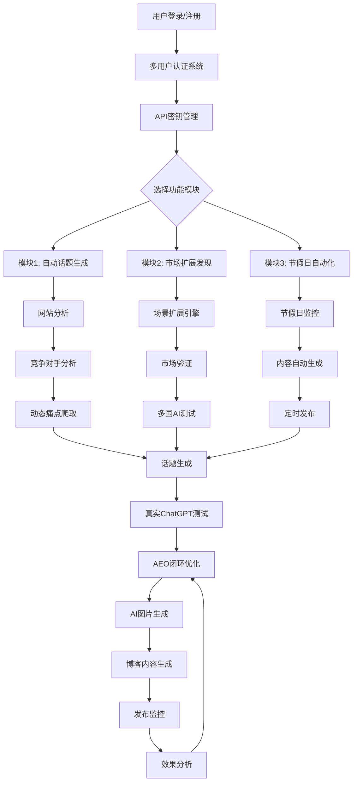

# 完整AI SEO博客生成系统流程

## 🎯 **系统概览**

这是一个完整的**AEO（AI Engine Optimization）多用户SaaS系统**，专门为"黑人祝福视频"等C2C产品优化AI搜索引擎排名。

---

## 🏗️ **系统架构图**



---

## 🚀 **完整流程详解**

### **阶段1: 用户认证与配置**

#### **1.1 用户注册/登录**
```
访问路径: /multi-user
功能: 多用户SaaS系统
- 用户注册（邮箱验证）
- 安全登录（JWT认证）
- 数据完全隔离（RLS策略）
```

#### **1.2 API密钥配置**
```
每个用户独立配置:
- OpenAI API Key (GPT, DALL-E)
- Google Gemini API Key
- Nanebanaen API Key (Stable Diffusion)
- Cloudinary API Key (图片处理)
- 所有密钥AES-256加密存储
```

#### **1.3 品牌设置**
```
个人品牌配置:
- 品牌名称和颜色
- Logo上传
- 水印设置
- SEO偏好设置
```

---

### **阶段2: 三大核心模块**

#### **模块1: 自动话题生成系统**
```
流程:
1. 输入网站URL (如: blessing-video.com)
2. 自动网站分析 → 提取产品信息
3. 竞争对手发现 → 自动识别同类网站
4. 动态痛点爬取 → Trustpilot/Google Reviews/Reddit
5. AI痛点分析 → 智能分类和优先级排序
6. 话题自动生成 → 基于痛点生成相关话题
7. 多国ChatGPT测试 → 验证话题在AI中的表现
8. 合格话题筛选 → 只保留能被AI推荐的话题
```

#### **模块2: 市场扩展发现系统**
```
流程:
1. 场景扩展引擎 → 发现新的使用场景
   - 生日祝福视频
   - 节日庆祝视频  
   - 毕业祝福视频
   - 婚礼祝福视频
   - 等等...

2. 用户选择界面 → AI推荐 + 用户确认
3. 市场验证 → 验证场景的市场需求
4. 多国AI审计 → 测试不同国家的AI响应
5. 场景优化 → 基于测试结果优化场景
6. 话题生成 → 为新场景生成相关话题
```

#### **模块3: 节假日自动化系统**
```
流程:
1. 全球节假日监控 → 25+国家节假日日历
   - 欧洲所有国家
   - 美国、加拿大
   - 澳大利亚、新西兰
   - 以色列、日本、韩国

2. 提前7天内容生成 → 自动为即将到来的节假日生成内容
3. 文化适配分析 → Gemini分析不同国家文化差异
4. 自动内容调度 → 定时发布节假日相关内容
5. 效果监控 → 跟踪节假日营销效果
```

---

### **阶段3: AI测试与验证**

#### **3.1 真实ChatGPT测试**
```
不是模拟，而是真实API调用:
1. 使用用户的OpenAI API Key
2. 直接调用ChatGPT API
3. 提问真实用户问题
4. 分析ChatGPT的实际回答
5. 检查网站是否被推荐
6. 分析推荐排名位置
```

#### **3.2 多国AI审计**
```
支持25+国家:
1. 不同国家的文化背景分析
2. 本地化问题生成
3. 多语言AI测试
4. 文化敏感性检查
5. 本地竞争对手分析
```

#### **3.3 AEO闭环优化**
```
完整闭环系统:
1. 话题测试 → ChatGPT实际响应
2. 结果分析 → 为什么被推荐/不被推荐
3. 竞争对手分析 → 分析被推荐的竞争对手
4. 数据源分析 → ChatGPT引用了哪些数据源
5. 内容优化 → 基于分析结果优化内容策略
6. 博客生成 → 生成针对性优化的博客
7. 发布监控 → 监控发布后的AI引用情况
8. 效果反馈 → 持续优化闭环
```

---

### **阶段4: 内容生成与优化**

#### **4.1 AI图片生成系统**
```
多种生成方式:
1. Gemini + Nanebanaen → 成本最低($0.021/张)
2. DALL-E 3 → 质量最高($0.04-0.08/张)
3. 本地图片修改 → 上传图片AI优化
4. 模板生成 → Chart.js图表/HTML表格

图片类型:
- 信息图表 (Infographics)
- 数据图表 (Charts)
- 流程图 (Diagrams)  
- 专业照片 (Photos)
- HTML表格 (Tables)

自动优化:
- 品牌水印添加
- SEO文件名优化
- 响应式设计
- 多尺寸适配
```

#### **4.2 博客内容生成**
```
AI引用优化博客:
1. 基于ChatGPT测试结果
2. 分析竞争对手被引用原因
3. 整合痛点数据
4. 生成高质量内容 (2500-3500字)
5. AI引用标准优化:
   - 事实密度高
   - 权威信号强
   - 结构化内容
   - 引用潜力评估

人性化处理:
- 避免AI检测
- 自然语言流畅度
- 个人化表达
- 情感共鸣内容
```

#### **4.3 多媒体集成**
```
完整内容包:
- 3-5张专业图片
- 数据可视化图表
- 信息图表
- 响应式HTML表格
- Mermaid流程图
- 品牌水印
- SEO优化元数据
```

---

### **阶段5: 发布与监控**

#### **5.1 内容发布**
```
自动化发布:
- 定时发布调度
- 多平台分发
- SEO元数据优化
- 社交媒体集成
```

#### **5.2 效果监控**
```
持续监控:
1. ChatGPT引用监控 → 检查博客是否被AI引用
2. 排名位置跟踪 → 监控在AI回答中的排名
3. 竞争对手监控 → 跟踪竞争对手表现
4. 流量分析 → 监控来自AI的流量
5. 转化跟踪 → 分析AI流量的转化率
```

#### **5.3 闭环优化**
```
基于监控结果:
1. 未被引用分析 → 分析原因并优化
2. 内容策略调整 → 基于效果调整策略
3. 新话题发现 → 发现新的优化机会
4. 竞争策略更新 → 应对竞争对手变化
```

---

## 📊 **用户使用统计**

### **成本控制**
```
每个用户独立追踪:
- 月度图片生成限制: 1000张
- 月度成本限制: $50
- API调用次数统计
- 存储空间使用量
- 实时成本计算
```

### **使用分析**
```
详细统计:
- 话题生成成功率
- ChatGPT测试通过率
- 博客AI引用率
- 图片生成质量评分
- 用户行为分析
```

---

## 🔐 **安全与隔离**

### **数据安全**
```
企业级安全:
- AES-256 API密钥加密
- JWT用户认证
- RLS数据库策略
- 审计日志记录
- HTTPS全程加密
```

### **用户隔离**
```
完全隔离:
- 每个用户独立数据库空间
- API密钥完全隔离
- 生成内容私有化
- 使用统计独立
- 成本计算分离
```

---

## 🎯 **核心价值**

### **对用户的价值**
1. **自动化AEO优化** → 无需手动研究AI引用规律
2. **真实AI测试** → 直接测试ChatGPT实际表现
3. **全球市场扩展** → 发现新的市场机会
4. **节假日自动化** → 抓住节假日营销机会
5. **成本可控** → 透明的API成本管理
6. **数据安全** → 企业级安全保护

### **技术优势**
1. **真实AI测试** → 不是模拟，是真实API调用
2. **动态痛点爬取** → 实时获取用户痛点
3. **多国文化适配** → 25+国家本地化
4. **闭环优化** → 持续改进系统
5. **多用户SaaS** → 完整的商业化系统

---

## 🚀 **使用流程总结**

```
1. 注册登录 → 配置API密钥 → 设置品牌
2. 选择模块 → 输入网站 → 自动分析
3. 痛点爬取 → 话题生成 → AI测试
4. 结果分析 → 内容优化 → 博客生成
5. 图片生成 → 多媒体集成 → 发布
6. 效果监控 → 闭环优化 → 持续改进
```

这是一个**完整的、商业化的、多用户的AI SEO优化SaaS系统**，专门针对AI搜索引擎优化，帮助用户在ChatGPT等AI工具中获得更好的推荐排名！