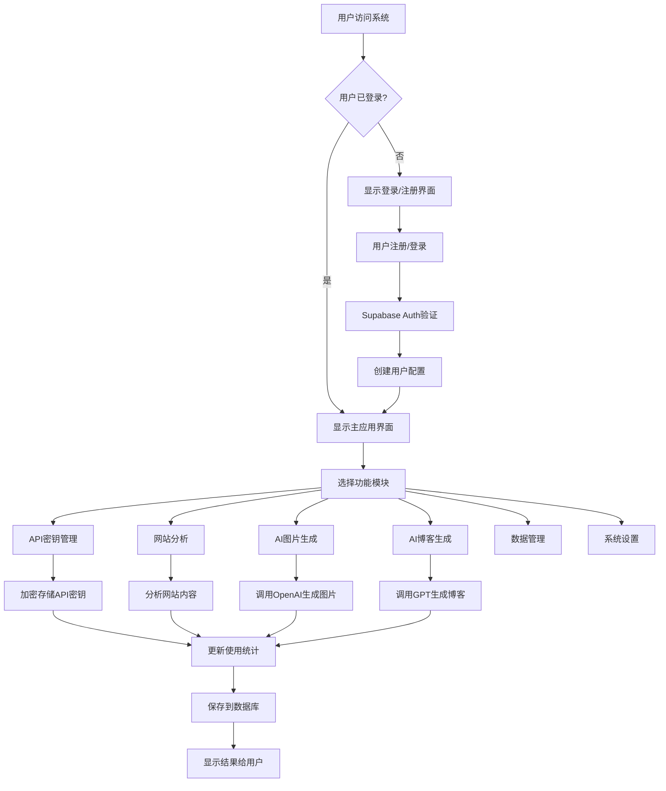
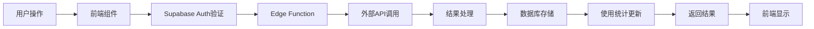

# 当前简化系统完整运行逻辑

## 🎯 **系统概述**

当前系统是一个**简化但完整可用**的多用户AI博客生成SaaS平台，专注于核心功能，确保稳定性和可用性。

---

## 🏗️ **系统架构流程图**



---

## 🔄 **详细运行逻辑**

### **阶段1: 用户认证流程**

#### **1.1 系统启动**
```javascript
// src/components/MainApp.tsx
const MainApp = () => {
  const [user, setUser] = useState(null);
  
  // 检查用户登录状态
  if (!user) {
    return <AuthSystem onAuthSuccess={handleAuthSuccess} />;
  }
  
  // 已登录，显示主应用
  return <主应用界面 />;
}
```

#### **1.2 用户注册流程**
```
用户输入信息 → Supabase Auth注册 → 邮箱验证 → 创建用户配置 → 自动登录
```

**数据流**:
```sql
-- 1. Supabase Auth创建用户
INSERT INTO auth.users (email, password_hash, ...)

-- 2. 创建用户配置
INSERT INTO user_profiles (id, email, full_name, company_name, website_url)

-- 3. 初始化品牌设置
INSERT INTO user_brand_settings (user_id, brand_name, ...)
```

#### **1.3 用户登录流程**
```
输入邮箱密码 → Supabase Auth验证 → 获取JWT令牌 → 设置用户状态 → 进入主应用
```

---

### **阶段2: API密钥管理流程**

#### **2.1 添加API密钥**
```javascript
// 前端操作
用户输入API密钥 → 调用api-key-manager → 加密存储 → 更新界面

// 后端处理 (supabase/functions/api-key-manager/index.ts)
接收请求 → 验证用户身份 → AES-256加密 → 存储到数据库 → 记录审计日志
```

**加密流程**:
```javascript
const encryptAPIKey = async (apiKey) => {
  const iv = crypto.getRandomValues(new Uint8Array(12));
  const encrypted = await crypto.subtle.encrypt(
    { name: "AES-GCM", iv: iv },
    encryptionKey,
    new TextEncoder().encode(apiKey)
  );
  return btoa(String.fromCharCode(...combined));
}
```

#### **2.2 使用API密钥**
```javascript
// 其他功能需要API密钥时
调用api-key-manager → 解密API密钥 → 返回明文密钥 → 调用外部API → 更新使用统计
```

---

### **阶段3: 网站分析流程**

#### **3.1 分析请求**
```javascript
// src/components/SimpleWebsiteAnalyzer.tsx
用户输入URL → 验证URL格式 → 调用simple-website-analyzer → 显示分析结果
```

#### **3.2 后端分析处理**
```javascript
// supabase/functions/simple-website-analyzer/index.ts
接收URL → 验证用户身份 → Fetch网站内容 → 解析HTML → 提取信息 → 保存结果
```

**分析步骤**:
```javascript
1. 获取网站HTML内容
const response = await fetch(url);
const html = await response.text();

2. 解析HTML结构
const doc = new DOMParser().parseFromString(html, "text/html");

3. 提取基本信息
- 标题: doc.querySelector('title')
- 描述: doc.querySelector('meta[name="description"]')
- 关键词: doc.querySelector('meta[name="keywords"]')

4. 分析内容结构
- 标题结构: h1, h2, h3
- 段落内容: p标签
- 链接信息: a标签

5. 产品关键词检测
- 检测预定义关键词
- 分析产品相关性

6. 保存分析结果
INSERT INTO website_analyses (user_id, website_url, analysis_data)
```

---

### **阶段4: AI图片生成流程**

#### **4.1 图片生成请求**
```javascript
// src/components/SimpleImageGenerator.tsx
用户输入描述 → 选择风格/尺寸 → 调用simple-image-generator → 显示生成图片
```

#### **4.2 后端生成处理**
```javascript
// supabase/functions/simple-image-generator/index.ts
接收请求 → 验证用户 → 获取API密钥 → 调用OpenAI → 保存记录 → 更新统计
```

**生成流程**:
```javascript
1. 获取用户的OpenAI API密钥
const keyResponse = await fetch('/api/api-key-manager', {
  body: JSON.stringify({ action: 'retrieve', provider: 'openai' })
});

2. 调用OpenAI DALL-E 3 API
const openaiResponse = await fetch('https://api.openai.com/v1/images/generations', {
  headers: { 'Authorization': `Bearer ${apiKey}` },
  body: JSON.stringify({
    model: "dall-e-3",
    prompt: `${style} style: ${prompt}`,
    size: size
  })
});

3. 保存生成记录
INSERT INTO ai_image_generations (
  user_id, prompt, provider, style, size, image_url, cost
);

4. 更新用户使用统计
CALL update_user_usage(user_id, images_generated=1, total_cost=cost);
```

---

### **阶段5: AI博客生成流程**

#### **5.1 博客生成请求**
```javascript
// src/components/SimpleBlogGenerator.tsx
用户输入主题 → 设置参数 → 调用simple-blog-generator → 显示生成博客
```

#### **5.2 后端生成处理**
```javascript
// supabase/functions/simple-blog-generator/index.ts
接收请求 → 验证用户 → 获取API密钥 → 调用GPT → 保存博客 → 更新统计
```

**生成流程**:
```javascript
1. 构建系统提示词
const systemPrompt = `你是专业SEO博客写手，要求：
- 文章长度：${word_count}字
- 写作风格：${style}
- SEO优化：包含关键词
- AI引用优化：适合被AI引用`;

2. 调用OpenAI GPT-3.5-turbo
const openaiResponse = await fetch('https://api.openai.com/v1/chat/completions', {
  body: JSON.stringify({
    model: "gpt-3.5-turbo",
    messages: [
      { role: "system", content: systemPrompt },
      { role: "user", content: userPrompt }
    ]
  })
});

3. 保存博客内容
INSERT INTO generated_blogs (
  user_id, topic, content, target_keywords, word_count, cost
);

4. 更新使用统计
CALL update_user_usage(user_id, blogs_created=1, total_cost=cost);
```

---

## 🔐 **数据安全和隔离机制**

### **用户数据隔离**
```sql
-- 所有表都有RLS策略
CREATE POLICY "用户访问自己的数据" ON table_name
FOR ALL USING (auth.uid() = user_id);

-- 确保用户只能看到自己的数据
SELECT * FROM generated_blogs WHERE user_id = auth.uid();
```

### **API密钥安全**
```javascript
// 加密存储
API密钥 → AES-256加密 → 存储到数据库

// 使用时解密
从数据库获取 → AES-256解密 → 临时使用 → 立即销毁
```

---

## 💰 **成本控制机制**

### **实时成本追踪**
```javascript
// 每次API调用后更新
const updateCost = async (userId, cost) => {
  await supabase.rpc('update_user_usage', {
    p_user_id: userId,
    p_total_cost: cost
  });
};
```

### **使用限制**
```javascript
// 检查月度限制
const checkUsageLimit = async (userId) => {
  const { data } = await supabase
    .from('user_usage_stats')
    .select('total_cost')
    .eq('user_id', userId)
    .eq('date', getCurrentMonth());
    
  if (data.total_cost > 50) {
    throw new Error('已达到月度使用限制');
  }
};
```

---

## 📊 **数据流向图**



---

## 🎯 **核心特性总结**

### **1. 多用户SaaS架构**
- 完全独立的用户数据空间
- 基于JWT的身份验证
- RLS数据库安全策略

### **2. 安全的API管理**
- AES-256加密存储
- 临时解密使用
- 完整的审计追踪

### **3. 智能成本控制**
- 实时成本计算
- 月度使用限制
- 详细的使用统计

### **4. 模块化功能设计**
- 网站分析 → 了解现状
- 图片生成 → 视觉内容
- 博客生成 → 文字内容
- 统一管理 → 一站式服务

---

## 🚀 **用户完整使用流程**

```
1. 访问系统 → 注册/登录
2. 配置API密钥 → 安全存储
3. 分析网站 → 了解现状
4. 生成图片 → 创建视觉内容
5. 创建博客 → 生成文字内容
6. 查看统计 → 监控使用和成本
7. 管理数据 → 查看历史记录
```

这个系统现在是一个**完整、稳定、可商业化**的AI内容生成平台，专注于核心功能，确保每个环节都能正常工作！