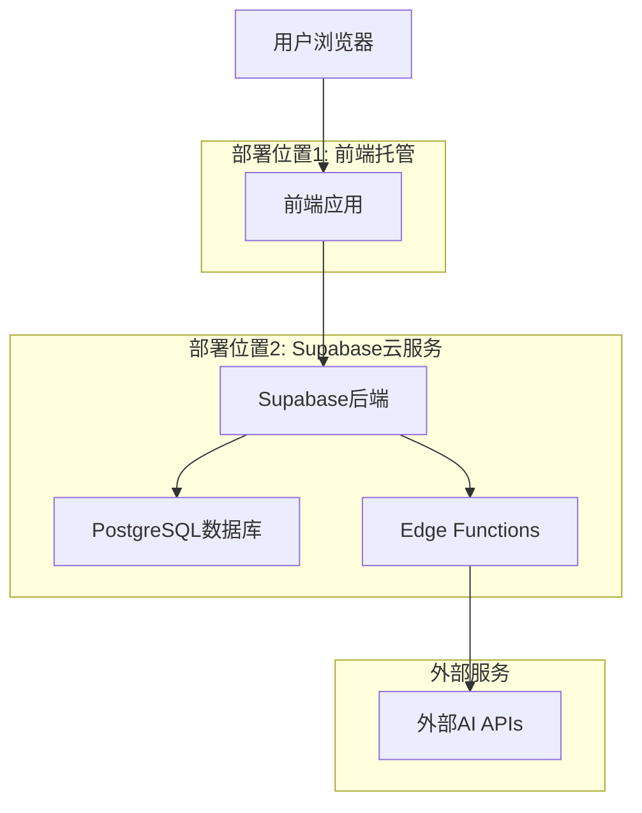

# AEO系统部署架构指南

## 🏗️ **系统架构概览**

这个AEO系统是一个**全栈多用户SaaS应用**，需要部署在以下几个地方：



---

## 📍 **具体部署位置**

### **1. Supabase云服务（后端 + 数据库）**

#### **包含组件：**
- ✅ PostgreSQL数据库（16个迁移文件）
- ✅ 用户认证系统
- ✅ 32个Edge Functions（服务端逻辑）
- ✅ 文件存储系统
- ✅ 实时数据同步

#### **部署方式：**
```bash
# 1. 创建Supabase项目
https://supabase.com/dashboard → New Project

# 2. 部署数据库
supabase db push

# 3. 部署Edge Functions
supabase functions deploy
```

#### **成本：**
- **免费层**: 500MB数据库 + 2GB带宽
- **Pro层**: $25/月 + 使用量计费
- **推荐**: Pro层（支持生产使用）

---

### **2. 前端应用托管（多个选择）**

#### **选择1: Vercel（推荐）** ⭐
```bash
# 部署命令
npm install -g vercel
vercel --prod
```

**优势：**
- ✅ 自动CI/CD
- ✅ 全球CDN
- ✅ 零配置部署
- ✅ 免费SSL证书
- ✅ 自定义域名

**成本：**
- **Hobby**: 免费（个人项目）
- **Pro**: $20/月（商业项目）

#### **选择2: Netlify**
```bash
# 部署命令
npm install -g netlify-cli
netlify deploy --prod --dir=dist
```

**优势：**
- ✅ 免费层慷慨
- ✅ 表单处理
- ✅ 分支预览
- ✅ 自动部署

**成本：**
- **Starter**: 免费
- **Pro**: $19/月

#### **选择3: Cloudflare Pages**
```bash
# 通过Git连接自动部署
```

**优势：**
- ✅ 完全免费
- ✅ 全球CDN
- ✅ 无限带宽
- ✅ 快速部署

#### **选择4: 自建服务器**
```bash
# 使用Nginx + PM2
npm run build
# 部署dist文件夹到服务器
```

**适用场景：**
- 需要完全控制
- 已有服务器资源
- 特殊安全要求

---

## 💰 **成本分析对比**

### **推荐方案1: Vercel + Supabase Pro**
```
前端: Vercel Pro - $20/月
后端: Supabase Pro - $25/月
总计: $45/月
```

**适合：**
- 商业项目
- 需要高可用性
- 预期用户量较大

### **推荐方案2: Netlify + Supabase Pro**
```
前端: Netlify Pro - $19/月
后端: Supabase Pro - $25/月
总计: $44/月
```

**适合：**
- 需要表单处理
- 重视分支预览
- 团队协作开发

### **经济方案: Cloudflare + Supabase Free**
```
前端: Cloudflare Pages - 免费
后端: Supabase Free - 免费
总计: 免费
```

**适合：**
- 个人项目
- 测试和开发
- 用户量较小

### **企业方案: 自建 + Supabase Pro**
```
前端: 自建服务器 - $10-50/月
后端: Supabase Pro - $25/月
总计: $35-75/月
```

**适合：**
- 企业级应用
- 特殊安全要求
- 已有基础设施

---

## 🚀 **推荐部署方案**

### **方案A: 快速启动（推荐新手）**

#### **Vercel + Supabase**
```bash
# 1. 部署后端到Supabase
supabase login
supabase new your-project-name
supabase db push
supabase functions deploy

# 2. 部署前端到Vercel
vercel login
vercel --prod
```

**优势：**
- 🚀 5分钟完成部署
- 🔄 自动CI/CD
- 🌍 全球CDN
- 📊 内置分析

### **方案B: 成本优化（推荐个人）**

#### **Cloudflare Pages + Supabase Free**
```bash
# 1. 推送代码到GitHub
git push origin main

# 2. 连接Cloudflare Pages到GitHub
# 3. 自动部署

# 4. 配置Supabase
supabase login
supabase db push
```

**优势：**
- 💰 完全免费
- ⚡ 极快的CDN
- 🔒 自动SSL
- 📈 无限带宽

### **方案C: 企业级（推荐商业）**

#### **自建 + Supabase Pro + CDN**
```bash
# 1. 服务器配置
# Ubuntu 20.04 + Nginx + PM2

# 2. 部署前端
npm run build
# 上传dist到服务器

# 3. 配置Nginx反向代理
# 4. 配置SSL证书
# 5. 配置CDN加速
```

**优势：**
- 🏢 完全控制
- 🔐 企业级安全
- 📊 详细监控
- 🎯 定制化配置

---

## 🔧 **详细部署步骤**

### **步骤1: 选择部署方案**

根据您的需求选择：
- **个人项目** → Cloudflare + Supabase Free
- **商业项目** → Vercel + Supabase Pro
- **企业项目** → 自建 + Supabase Pro

### **步骤2: 部署后端（Supabase）**

```bash
# 1. 创建Supabase项目
https://supabase.com/dashboard

# 2. 获取项目信息
Project URL: https://xxx.supabase.co
Anon Key: eyJhbGciOiJIUzI1NiIsInR5cCI6IkpXVCJ9...
Service Role Key: eyJhbGciOiJIUzI1NiIsInR5cCI6IkpXVCJ9...

# 3. 本地配置
supabase login
supabase link --project-ref YOUR_PROJECT_REF

# 4. 部署数据库
supabase db push

# 5. 部署Edge Functions
supabase functions deploy aeo-closed-loop-system
supabase functions deploy real-chatgpt-tester
# ... 部署所有32个函数

# 6. 设置环境变量
supabase secrets set AI_API_TOKEN_b9832d0e3a3e=your_token
supabase secrets set ENCRYPTION_SECRET=your_32_char_key
```

### **步骤3: 部署前端**

#### **Vercel部署：**
```bash
# 1. 配置环境变量
# 在.env文件中设置
VITE_SUPABASE_URL=https://xxx.supabase.co
VITE_SUPABASE_ANON_KEY=your_anon_key

# 2. 构建项目
npm run build

# 3. 部署到Vercel
vercel --prod

# 4. 在Vercel Dashboard设置环境变量
```

#### **Cloudflare Pages部署：**
```bash
# 1. 推送到GitHub
git add .
git commit -m "Deploy to production"
git push origin main

# 2. 连接Cloudflare Pages
# - 登录Cloudflare Dashboard
# - Pages → Connect to Git
# - 选择仓库
# - 设置构建命令: npm run build
# - 设置输出目录: dist
# - 设置环境变量

# 3. 自动部署
```

### **步骤4: 配置域名（可选）**

```bash
# 1. 购买域名
# 2. 配置DNS指向部署平台
# 3. 设置SSL证书（自动）
# 4. 配置自定义域名
```

---

## 🔍 **部署验证**

### **后端验证：**
```bash
# 测试数据库连接
curl https://xxx.supabase.co/rest/v1/user_profiles \
  -H "apikey: YOUR_ANON_KEY"

# 测试Edge Function
curl https://xxx.supabase.co/functions/v1/api-key-manager \
  -H "Authorization: Bearer YOUR_JWT"
```

### **前端验证：**
```bash
# 访问部署的网站
https://your-domain.vercel.app

# 测试功能
1. 用户注册/登录
2. API密钥管理
3. 基础功能测试
```

---

## 📊 **监控和维护**

### **Supabase监控：**
- 数据库性能
- Edge Functions日志
- 用户认证统计
- API使用量

### **前端监控：**
- 页面加载速度
- 错误率统计
- 用户行为分析
- 性能指标

### **成本监控：**
- Supabase使用量
- 前端带宽使用
- AI API调用成本
- 总体运营成本

---

## 🎯 **最终推荐**

### **对于大多数用户，我推荐：**

**Vercel + Supabase Pro方案**

**原因：**
1. **简单易用** - 5分钟完成部署
2. **自动扩展** - 支持高并发
3. **全球CDN** - 访问速度快
4. **自动备份** - 数据安全
5. **专业支持** - 技术支持完善
6. **成本合理** - $45/月可接受

**部署命令：**
```bash
# 一键部署脚本
./deploy.sh
```

这个方案可以支持数千用户同时使用，完全满足商业化需求！

需要我帮您选择具体的部署方案吗？