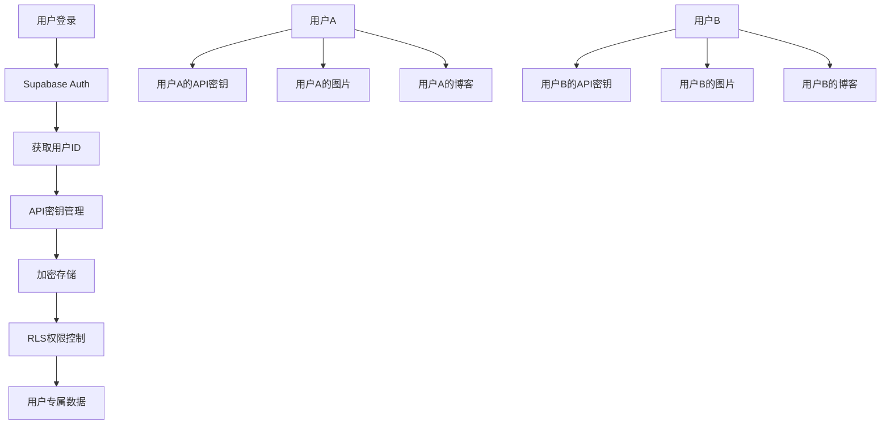

# 多用户认证和API密钥管理系统

## 🎯 **你的需求分析**

### **核心需求**
1. **用户登录系统** - 每个用户独立账户
2. **API密钥管理** - 用户填写和存储自己的API密钥
3. **数据隔离** - 用户只能看到自己的数据
4. **安全存储** - API密钥加密存储在Supabase
5. **权限控制** - 完整的RLS（行级安全）策略

---

## 🏗️ **系统架构设计**

### **用户数据隔离架构**


### **数据隔离策略**
```javascript
const dataIsolationStrategy = {
  user_level_isolation: {
    api_keys: "每个用户独立的API密钥",
    generated_content: "用户只能访问自己生成的内容",
    usage_statistics: "独立的使用统计和成本追踪",
    brand_settings: "个人品牌设置和水印配置"
  },
  
  security_measures: {
    encryption: "API密钥AES-256加密存储",
    rls_policies: "数据库行级安全策略",
    jwt_validation: "JWT令牌验证用户身份",
    audit_logging: "用户操作审计日志"
  }
};
```

---

## 🔐 **数据库设计**

### **用户和API密钥管理表**
```sql
-- 用户配置表
CREATE TABLE user_profiles (
    id UUID REFERENCES auth.users(id) PRIMARY KEY,
    email TEXT NOT NULL,
    full_name TEXT,
    company_name TEXT,
    website_url TEXT,
    created_at TIMESTAMP WITH TIME ZONE DEFAULT NOW(),
    updated_at TIMESTAMP WITH TIME ZONE DEFAULT NOW(),
    is_active BOOLEAN DEFAULT true
);

-- API密钥管理表
CREATE TABLE user_api_keys (
    id UUID DEFAULT gen_random_uuid() PRIMARY KEY,
    user_id UUID REFERENCES auth.users(id) ON DELETE CASCADE,
    api_provider TEXT NOT NULL, -- 'openai', 'gemini', 'nanebanaen', 'cloudinary'
    api_key_encrypted TEXT NOT NULL, -- 加密后的API密钥
    api_key_name TEXT, -- 用户自定义的密钥名称
    is_active BOOLEAN DEFAULT true,
    last_used_at TIMESTAMP WITH TIME ZONE,
    usage_count INTEGER DEFAULT 0,
    monthly_cost DECIMAL(10,4) DEFAULT 0,
    created_at TIMESTAMP WITH TIME ZONE DEFAULT NOW(),
    updated_at TIMESTAMP WITH TIME ZONE DEFAULT NOW(),
    UNIQUE(user_id, api_provider)
);

-- 用户品牌设置表
CREATE TABLE user_brand_settings (
    id UUID DEFAULT gen_random_uuid() PRIMARY KEY,
    user_id UUID REFERENCES auth.users(id) ON DELETE CASCADE,
    brand_name TEXT NOT NULL,
    brand_color TEXT DEFAULT '#2563eb',
    logo_url TEXT,
    watermark_content TEXT,
    watermark_position TEXT DEFAULT 'bottom_right',
    watermark_opacity DECIMAL(3,2) DEFAULT 0.7,
    font_family TEXT DEFAULT 'Inter',
    is_default BOOLEAN DEFAULT false,
    created_at TIMESTAMP WITH TIME ZONE DEFAULT NOW(),
    updated_at TIMESTAMP WITH TIME ZONE DEFAULT NOW()
);

-- 用户使用统计表
CREATE TABLE user_usage_stats (
    id UUID DEFAULT gen_random_uuid() PRIMARY KEY,
    user_id UUID REFERENCES auth.users(id) ON DELETE CASCADE,
    date DATE DEFAULT CURRENT_DATE,
    images_generated INTEGER DEFAULT 0,
    blogs_created INTEGER DEFAULT 0,
    api_calls_made INTEGER DEFAULT 0,
    total_cost DECIMAL(10,4) DEFAULT 0,
    storage_used_mb DECIMAL(10,2) DEFAULT 0,
    created_at TIMESTAMP WITH TIME ZONE DEFAULT NOW(),
    UNIQUE(user_id, date)
);

-- 用户操作审计日志
CREATE TABLE user_audit_logs (
    id UUID DEFAULT gen_random_uuid() PRIMARY KEY,
    user_id UUID REFERENCES auth.users(id) ON DELETE CASCADE,
    action_type TEXT NOT NULL, -- 'login', 'api_key_added', 'image_generated', etc.
    action_details JSONB DEFAULT '{}',
    ip_address INET,
    user_agent TEXT,
    created_at TIMESTAMP WITH TIME ZONE DEFAULT NOW()
);
```

### **RLS安全策略**
```sql
-- 启用RLS
ALTER TABLE user_profiles ENABLE ROW LEVEL SECURITY;
ALTER TABLE user_api_keys ENABLE ROW LEVEL SECURITY;
ALTER TABLE user_brand_settings ENABLE ROW LEVEL SECURITY;
ALTER TABLE user_usage_stats ENABLE ROW LEVEL SECURITY;
ALTER TABLE user_audit_logs ENABLE ROW LEVEL SECURITY;

-- 用户只能访问自己的数据
CREATE POLICY "用户访问自己的配置" ON user_profiles
FOR ALL USING (auth.uid() = id);

CREATE POLICY "用户管理自己的API密钥" ON user_api_keys
FOR ALL USING (auth.uid() = user_id);

CREATE POLICY "用户管理自己的品牌设置" ON user_brand_settings
FOR ALL USING (auth.uid() = user_id);

CREATE POLICY "用户查看自己的使用统计" ON user_usage_stats
FOR ALL USING (auth.uid() = user_id);

CREATE POLICY "用户查看自己的审计日志" ON user_audit_logs
FOR SELECT USING (auth.uid() = user_id);

-- 更新现有表的RLS策略
ALTER TABLE ai_image_generations ENABLE ROW LEVEL SECURITY;
ALTER TABLE generated_images ENABLE ROW LEVEL SECURITY;

-- 为现有表添加user_id列
ALTER TABLE ai_image_generations ADD COLUMN user_id UUID REFERENCES auth.users(id);
ALTER TABLE generated_images ADD COLUMN user_id UUID REFERENCES auth.users(id);

-- 现有表的RLS策略
CREATE POLICY "用户访问自己的图片生成记录" ON ai_image_generations
FOR ALL USING (auth.uid() = user_id);

CREATE POLICY "用户访问自己的生成图片" ON generated_images
FOR ALL USING (auth.uid() = user_id);

-- 存储桶的用户隔离策略
CREATE POLICY "用户访问自己的上传文件" ON storage.objects
FOR ALL USING (
  bucket_id = 'user-uploads' 
  AND auth.uid()::text = (storage.foldername(name))[1]
);

CREATE POLICY "用户访问自己的处理后图片" ON storage.objects
FOR ALL USING (
  bucket_id = 'processed-images' 
  AND auth.uid()::text = (storage.foldername(name))[1]
);
```

---

## 🔑 **API密钥加密系统**

### **加密/解密Edge Function**
```typescript
// supabase/functions/api-key-manager/index.ts
import { serve } from "https://deno.land/std@0.168.0/http/server.ts";
import { createClient } from "https://esm.sh/@supabase/supabase-js@2.7.1";
import { crypto } from "https://deno.land/std@0.168.0/crypto/mod.ts";

const corsHeaders = {
  "Access-Control-Allow-Origin": "*",
  "Access-Control-Allow-Headers": "authorization, x-client-info, apikey, content-type",
};

interface APIKeyRequest {
  action: 'store' | 'retrieve' | 'update' | 'delete' | 'list';
  provider: 'openai' | 'gemini' | 'nanebanaen' | 'cloudinary';
  api_key?: string;
  key_name?: string;
}

class APIKeyManager {
  private supabase: any;
  private encryptionKey: CryptoKey;

  constructor() {
    const supabaseUrl = Deno.env.get("SUPABASE_URL") || "";
    const supabaseKey = Deno.env.get("SUPABASE_SERVICE_ROLE_KEY") || "";
    this.supabase = createClient(supabaseUrl, supabaseKey);
  }

  async initialize() {
    // 生成或获取加密密钥
    const keyMaterial = await crypto.subtle.importKey(
      "raw",
      new TextEncoder().encode(Deno.env.get("ENCRYPTION_SECRET") || "default-secret-key-32-chars-long"),
      { name: "PBKDF2" },
      false,
      ["deriveBits", "deriveKey"]
    );

    this.encryptionKey = await crypto.subtle.deriveKey(
      {
        name: "PBKDF2",
        salt: new TextEncoder().encode("api-key-salt"),
        iterations: 100000,
        hash: "SHA-256",
      },
      keyMaterial,
      { name: "AES-GCM", length: 256 },
      true,
      ["encrypt", "decrypt"]
    );
  }

  async encryptAPIKey(apiKey: string): Promise<string> {
    const iv = crypto.getRandomValues(new Uint8Array(12));
    const encodedKey = new TextEncoder().encode(apiKey);
    
    const encrypted = await crypto.subtle.encrypt(
      { name: "AES-GCM", iv: iv },
      this.encryptionKey,
      encodedKey
    );

    // 组合IV和加密数据
    const combined = new Uint8Array(iv.length + encrypted.byteLength);
    combined.set(iv);
    combined.set(new Uint8Array(encrypted), iv.length);
    
    return btoa(String.fromCharCode(...combined));
  }

  async decryptAPIKey(encryptedKey: string): Promise<string> {
    const combined = new Uint8Array(
      atob(encryptedKey).split('').map(char => char.charCodeAt(0))
    );
    
    const iv = combined.slice(0, 12);
    const encrypted = combined.slice(12);

    const decrypted = await crypto.subtle.decrypt(
      { name: "AES-GCM", iv: iv },
      this.encryptionKey,
      encrypted
    );

    return new TextDecoder().decode(decrypted);
  }

  async storeAPIKey(userId: string, provider: string, apiKey: string, keyName?: string): Promise<any> {
    const encryptedKey = await this.encryptAPIKey(apiKey);
    
    const { data, error } = await this.supabase
      .from('user_api_keys')
      .upsert({
        user_id: userId,
        api_provider: provider,
        api_key_encrypted: encryptedKey,
        api_key_name: keyName || `${provider} API Key`,
        is_active: true,
        updated_at: new Date().toISOString()
      }, {
        onConflict: 'user_id,api_provider'
      });

    if (error) throw error;

    // 记录审计日志
    await this.logUserAction(userId, 'api_key_stored', { provider, key_name: keyName });

    return { success: true, message: `${provider} API密钥已安全存储` };
  }

  async retrieveAPIKey(userId: string, provider: string): Promise<string> {
    const { data, error } = await this.supabase
      .from('user_api_keys')
      .select('api_key_encrypted')
      .eq('user_id', userId)
      .eq('api_provider', provider)
      .eq('is_active', true)
      .single();

    if (error || !data) {
      throw new Error(`未找到${provider}的API密钥`);
    }

    // 更新使用统计
    await this.supabase
      .from('user_api_keys')
      .update({
        last_used_at: new Date().toISOString(),
        usage_count: this.supabase.raw('usage_count + 1')
      })
      .eq('user_id', userId)
      .eq('api_provider', provider);

    return await this.decryptAPIKey(data.api_key_encrypted);
  }

  async listUserAPIKeys(userId: string): Promise<any[]> {
    const { data, error } = await this.supabase
      .from('user_api_keys')
      .select('api_provider, api_key_name, is_active, last_used_at, usage_count, monthly_cost, created_at')
      .eq('user_id', userId)
      .order('created_at', { ascending: false });

    if (error) throw error;

    return data || [];
  }

  async deleteAPIKey(userId: string, provider: string): Promise<any> {
    const { error } = await this.supabase
      .from('user_api_keys')
      .delete()
      .eq('user_id', userId)
      .eq('api_provider', provider);

    if (error) throw error;

    await this.logUserAction(userId, 'api_key_deleted', { provider });

    return { success: true, message: `${provider} API密钥已删除` };
  }

  private async logUserAction(userId: string, action: string, details: any): Promise<void> {
    await this.supabase
      .from('user_audit_logs')
      .insert({
        user_id: userId,
        action_type: action,
        action_details: details,
        created_at: new Date().toISOString()
      });
  }
}

serve(async (req) => {
  if (req.method === "OPTIONS") {
    return new Response(null, { headers: corsHeaders });
  }

  try {
    const { action, provider, api_key, key_name }: APIKeyRequest = await req.json();
    
    // 验证用户身份
    const authHeader = req.headers.get('Authorization');
    if (!authHeader) {
      throw new Error('未提供认证信息');
    }

    const supabase = createClient(
      Deno.env.get("SUPABASE_URL") || "",
      Deno.env.get("SUPABASE_ANON_KEY") || "",
      {
        global: {
          headers: { Authorization: authHeader }
        }
      }
    );

    const { data: { user }, error: authError } = await supabase.auth.getUser();
    if (authError || !user) {
      throw new Error('用户认证失败');
    }

    const keyManager = new APIKeyManager();
    await keyManager.initialize();

    let result;
    switch (action) {
      case 'store':
        if (!api_key) throw new Error('API密钥不能为空');
        result = await keyManager.storeAPIKey(user.id, provider, api_key, key_name);
        break;
      
      case 'retrieve':
        const decryptedKey = await keyManager.retrieveAPIKey(user.id, provider);
        result = { api_key: decryptedKey };
        break;
      
      case 'list':
        result = await keyManager.listUserAPIKeys(user.id);
        break;
      
      case 'delete':
        result = await keyManager.deleteAPIKey(user.id, provider);
        break;
      
      default:
        throw new Error('不支持的操作');
    }

    return new Response(
      JSON.stringify({ success: true, data: result }),
      { headers: { ...corsHeaders, "Content-Type": "application/json" } }
    );

  } catch (error) {
    console.error("[API Key Manager] Error:", error);
    return new Response(
      JSON.stringify({ success: false, error: error.message }),
      { status: 400, headers: { ...corsHeaders, "Content-Type": "application/json" } }
    );
  }
});
```

---

## 🖥️ **前端认证系统**

### **登录/注册组件**
```typescript
// src/components/AuthSystem.tsx
import React, { useState, useEffect } from 'react';
import { createClient } from '@supabase/supabase-js';
import { Card, CardContent, CardDescription, CardHeader, CardTitle } from '@/components/ui/card';
import { Button } from '@/components/ui/button';
import { Input } from '@/components/ui/input';
import { Label } from '@/components/ui/label';
import { Tabs, TabsContent, TabsList, TabsTrigger } from '@/components/ui/tabs';
import { Alert, AlertDescription } from '@/components/ui/alert';
import { User, Mail, Lock, Building, Globe } from 'lucide-react';

const supabase = createClient(
  process.env.NEXT_PUBLIC_SUPABASE_URL!,
  process.env.NEXT_PUBLIC_SUPABASE_ANON_KEY!
);

interface AuthSystemProps {
  onAuthSuccess: (user: any) => void;
}

const AuthSystem: React.FC<AuthSystemProps> = ({ onAuthSuccess }) => {
  const [loading, setLoading] = useState(false);
  const [error, setError] = useState<string | null>(null);
  const [user, setUser] = useState<any>(null);

  // 登录表单状态
  const [loginForm, setLoginForm] = useState({
    email: '',
    password: ''
  });

  // 注册表单状态
  const [registerForm, setRegisterForm] = useState({
    email: '',
    password: '',
    confirmPassword: '',
    fullName: '',
    companyName: '',
    websiteUrl: ''
  });

  useEffect(() => {
    // 检查当前用户状态
    supabase.auth.getSession().then(({ data: { session } }) => {
      if (session?.user) {
        setUser(session.user);
        onAuthSuccess(session.user);
      }
    });

    // 监听认证状态变化
    const { data: { subscription } } = supabase.auth.onAuthStateChange(
      async (event, session) => {
        if (session?.user) {
          setUser(session.user);
          onAuthSuccess(session.user);
        } else {
          setUser(null);
        }
      }
    );

    return () => subscription.unsubscribe();
  }, [onAuthSuccess]);

  const handleLogin = async (e: React.FormEvent) => {
    e.preventDefault();
    setLoading(true);
    setError(null);

    try {
      const { data, error } = await supabase.auth.signInWithPassword({
        email: loginForm.email,
        password: loginForm.password
      });

      if (error) throw error;

      // 记录登录日志
      await fetch('/api/api-key-manager', {
        method: 'POST',
        headers: {
          'Content-Type': 'application/json',
          'Authorization': `Bearer ${data.session?.access_token}`
        },
        body: JSON.stringify({
          action: 'log_action',
          action_type: 'login',
          details: { login_method: 'email_password' }
        })
      });

    } catch (error: any) {
      setError(error.message);
    } finally {
      setLoading(false);
    }
  };

  const handleRegister = async (e: React.FormEvent) => {
    e.preventDefault();
    setLoading(true);
    setError(null);

    if (registerForm.password !== registerForm.confirmPassword) {
      setError('密码确认不匹配');
      setLoading(false);
      return;
    }

    try {
      const { data, error } = await supabase.auth.signUp({
        email: registerForm.email,
        password: registerForm.password,
        options: {
          data: {
            full_name: registerForm.fullName,
            company_name: registerForm.companyName,
            website_url: registerForm.websiteUrl
          }
        }
      });

      if (error) throw error;

      // 创建用户配置
      if (data.user) {
        await supabase.from('user_profiles').insert({
          id: data.user.id,
          email: registerForm.email,
          full_name: registerForm.fullName,
          company_name: registerForm.companyName,
          website_url: registerForm.websiteUrl
        });
      }

      setError('注册成功！请检查邮箱验证链接。');
    } catch (error: any) {
      setError(error.message);
    } finally {
      setLoading(false);
    }
  };

  const handleLogout = async () => {
    await supabase.auth.signOut();
  };

  if (user) {
    return (
      <div className="flex items-center justify-between p-4 bg-green-50 border border-green-200 rounded-lg">
        <div className="flex items-center space-x-3">
          <User className="w-5 h-5 text-green-600" />
          <div>
            <p className="font-medium text-green-800">已登录</p>
            <p className="text-sm text-green-600">{user.email}</p>
          </div>
        </div>
        <Button variant="outline" onClick={handleLogout}>
          退出登录
        </Button>
      </div>
    );
  }

  return (
    <Card className="w-full max-w-md mx-auto">
      <CardHeader>
        <CardTitle>AI博客生成系统</CardTitle>
        <CardDescription>登录或注册以开始使用</CardDescription>
      </CardHeader>
      <CardContent>
        <Tabs defaultValue="login" className="space-y-4">
          <TabsList className="grid w-full grid-cols-2">
            <TabsTrigger value="login">登录</TabsTrigger>
            <TabsTrigger value="register">注册</TabsTrigger>
          </TabsList>

          <TabsContent value="login" className="space-y-4">
            <form onSubmit={handleLogin} className="space-y-4">
              <div className="space-y-2">
                <Label htmlFor="login-email">邮箱</Label>
                <div className="relative">
                  <Mail className="absolute left-3 top-3 h-4 w-4 text-gray-400" />
                  <Input
                    id="login-email"
                    type="email"
                    placeholder="your@email.com"
                    className="pl-10"
                    value={loginForm.email}
                    onChange={(e) => setLoginForm({...loginForm, email: e.target.value})}
                    required
                  />
                </div>
              </div>

              <div className="space-y-2">
                <Label htmlFor="login-password">密码</Label>
                <div className="relative">
                  <Lock className="absolute left-3 top-3 h-4 w-4 text-gray-400" />
                  <Input
                    id="login-password"
                    type="password"
                    placeholder="••••••••"
                    className="pl-10"
                    value={loginForm.password}
                    onChange={(e) => setLoginForm({...loginForm, password: e.target.value})}
                    required
                  />
                </div>
              </div>

              <Button type="submit" className="w-full" disabled={loading}>
                {loading ? '登录中...' : '登录'}
              </Button>
            </form>
          </TabsContent>

          <TabsContent value="register" className="space-y-4">
            <form onSubmit={handleRegister} className="space-y-4">
              <div className="grid grid-cols-2 gap-4">
                <div className="space-y-2">
                  <Label htmlFor="register-name">姓名</Label>
                  <div className="relative">
                    <User className="absolute left-3 top-3 h-4 w-4 text-gray-400" />
                    <Input
                      id="register-name"
                      placeholder="张三"
                      className="pl-10"
                      value={registerForm.fullName}
                      onChange={(e) => setRegisterForm({...registerForm, fullName: e.target.value})}
                      required
                    />
                  </div>
                </div>

                <div className="space-y-2">
                  <Label htmlFor="register-company">公司名称</Label>
                  <div className="relative">
                    <Building className="absolute left-3 top-3 h-4 w-4 text-gray-400" />
                    <Input
                      id="register-company"
                      placeholder="公司名称"
                      className="pl-10"
                      value={registerForm.companyName}
                      onChange={(e) => setRegisterForm({...registerForm, companyName: e.target.value})}
                    />
                  </div>
                </div>
              </div>

              <div className="space-y-2">
                <Label htmlFor="register-website">网站URL (可选)</Label>
                <div className="relative">
                  <Globe className="absolute left-3 top-3 h-4 w-4 text-gray-400" />
                  <Input
                    id="register-website"
                    type="url"
                    placeholder="https://yourwebsite.com"
                    className="pl-10"
                    value={registerForm.websiteUrl}
                    onChange={(e) => setRegisterForm({...registerForm, websiteUrl: e.target.value})}
                  />
                </div>
              </div>

              <div className="space-y-2">
                <Label htmlFor="register-email">邮箱</Label>
                <div className="relative">
                  <Mail className="absolute left-3 top-3 h-4 w-4 text-gray-400" />
                  <Input
                    id="register-email"
                    type="email"
                    placeholder="your@email.com"
                    className="pl-10"
                    value={registerForm.email}
                    onChange={(e) => setRegisterForm({...registerForm, email: e.target.value})}
                    required
                  />
                </div>
              </div>

              <div className="space-y-2">
                <Label htmlFor="register-password">密码</Label>
                <div className="relative">
                  <Lock className="absolute left-3 top-3 h-4 w-4 text-gray-400" />
                  <Input
                    id="register-password"
                    type="password"
                    placeholder="••••••••"
                    className="pl-10"
                    value={registerForm.password}
                    onChange={(e) => setRegisterForm({...registerForm, password: e.target.value})}
                    required
                  />
                </div>
              </div>

              <div className="space-y-2">
                <Label htmlFor="register-confirm">确认密码</Label>
                <div className="relative">
                  <Lock className="absolute left-3 top-3 h-4 w-4 text-gray-400" />
                  <Input
                    id="register-confirm"
                    type="password"
                    placeholder="••••••••"
                    className="pl-10"
                    value={registerForm.confirmPassword}
                    onChange={(e) => setRegisterForm({...registerForm, confirmPassword: e.target.value})}
                    required
                  />
                </div>
              </div>

              <Button type="submit" className="w-full" disabled={loading}>
                {loading ? '注册中...' : '注册账户'}
              </Button>
            </form>
          </TabsContent>
        </Tabs>

        {error && (
          <Alert className="mt-4">
            <AlertDescription>{error}</AlertDescription>
          </Alert>
        )}
      </CardContent>
    </Card>
  );
};

export default AuthSystem;
```

---

## 🔑 **API密钥管理界面**

### **API密钥配置组件**
```typescript
// src/components/APIKeyManager.tsx
import React, { useState, useEffect } from 'react';
import { Card, CardContent, CardDescription, CardHeader, CardTitle } from '@/components/ui/card';
import { Button } from '@/components/ui/button';
import { Input } from '@/components/ui/input';
import { Label } from '@/components/ui/label';
import { Badge } from '@/components/ui/badge';
import { Alert, AlertDescription } from '@/components/ui/alert';
import { 
  Key, 
  Eye, 
  EyeOff, 
  Plus, 
  Trash2, 
  CheckCircle, 
  AlertCircle,
  DollarSign,
  Calendar
} from 'lucide-react';

interface APIKey {
  api_provider: string;
  api_key_name: string;
  is_active: boolean;
  last_used_at: string | null;
  usage_count: number;
  monthly_cost: number;
  created_at: string;
}

interface APIKeyManagerProps {
  user: any;
}

const APIKeyManager: React.FC<APIKeyManagerProps> = ({ user }) => {
  const [apiKeys, setApiKeys] = useState<APIKey[]>([]);
  const [loading, setLoading] = useState(false);
  const [error, setError] = useState<string | null>(null);
  const [success, setSuccess] = useState<string | null>(null);
  const [showAddForm, setShowAddForm] = useState(false);
  const [newKeyForm, setNewKeyForm] = useState({
    provider: 'openai',
    api_key: '',
    key_name: ''
  });
  const [showKeys, setShowKeys] = useState<{[key: string]: boolean}>({});

  useEffect(() => {
    loadAPIKeys();
  }, []);

  const loadAPIKeys = async () => {
    setLoading(true);
    try {
      const response = await fetch('/api/api-key-manager', {
        method: 'POST',
        headers: {
          'Content-Type': 'application/json',
          'Authorization': `Bearer ${user.access_token}`
        },
        body: JSON.stringify({ action: 'list' })
      });

      const data = await response.json();
      if (data.success) {
        setApiKeys(data.data);
      } else {
        setError(data.error);
      }
    } catch (error: any) {
      setError('加载API密钥失败');
    } finally {
      setLoading(false);
    }
  };

  const handleAddAPIKey = async (e: React.FormEvent) => {
    e.preventDefault();
    setLoading(true);
    setError(null);
    setSuccess(null);

    try {
      const response = await fetch('/api/api-key-manager', {
        method: 'POST',
        headers: {
          'Content-Type': 'application/json',
          'Authorization': `Bearer ${user.access_token}`
        },
        body: JSON.stringify({
          action: 'store',
          provider: newKeyForm.provider,
          api_key: newKeyForm.api_key,
          key_name: newKeyForm.key_name || `${newKeyForm.provider} API Key`
        })
      });

      const data = await response.json();
      if (data.success) {
        setSuccess(data.data.message);
        setNewKeyForm({ provider: 'openai', api_key: '', key_name: '' });
        setShowAddForm(false);
        loadAPIKeys();
      } else {
        setError(data.error);
      }
    } catch (error: any) {
      setError('添加API密钥失败');
    } finally {
      setLoading(false);
    }
  };

  const handleDeleteAPIKey = async (provider: string) => {
    if (!confirm(`确定要删除 ${provider} API密钥吗？`)) return;

    setLoading(true);
    try {
      const response = await fetch('/api/api-key-manager', {
        method: 'POST',
        headers: {
          'Content-Type': 'application/json',
          'Authorization': `Bearer ${user.access_token}`
        },
        body: JSON.stringify({
          action: 'delete',
          provider: provider
        })
      });

      const data = await response.json();
      if (data.success) {
        setSuccess(data.data.message);
        loadAPIKeys();
      } else {
        setError(data.error);
      }
    } catch (error: any) {
      setError('删除API密钥失败');
    } finally {
      setLoading(false);
    }
  };

  const getProviderInfo = (provider: string) => {
    const providerMap = {
      openai: { name: 'OpenAI', color: 'bg-green-100 text-green-800', icon: '🤖' },
      gemini: { name: 'Google Gemini', color: 'bg-blue-100 text-blue-800', icon: '💎' },
      nanebanaen: { name: 'Nanebanaen', color: 'bg-purple-100 text-purple-800', icon: '🎨' },
      cloudinary: { name: 'Cloudinary', color: 'bg-orange-100 text-orange-800', icon: '☁️' }
    };
    return providerMap[provider] || { name: provider, color: 'bg-gray-100 text-gray-800', icon: '🔑' };
  };

  return (
    <div className="space-y-6">
      <Card>
        <CardHeader className="flex flex-row items-center justify-between">
          <div>
            <CardTitle>API密钥管理</CardTitle>
            <CardDescription>安全管理您的AI服务API密钥</CardDescription>
          </div>
          <Button onClick={() => setShowAddForm(!showAddForm)}>
            <Plus className="w-4 h-4 mr-2" />
            添加API密钥
          </Button>
        </CardHeader>
        <CardContent className="space-y-4">
          {error && (
            <Alert variant="destructive">
              <AlertCircle className="h-4 w-4" />
              <AlertDescription>{error}</AlertDescription>
            </Alert>
          )}

          {success && (
            <Alert>
              <CheckCircle className="h-4 w-4" />
              <AlertDescription>{success}</AlertDescription>
            </Alert>
          )}

          {showAddForm && (
            <Card className="border-dashed">
              <CardContent className="pt-6">
                <form onSubmit={handleAddAPIKey} className="space-y-4">
                  <div className="grid grid-cols-2 gap-4">
                    <div className="space-y-2">
                      <Label>API服务商</Label>
                      <select
                        className="w-full p-2 border rounded-md"
                        value={newKeyForm.provider}
                        onChange={(e) => setNewKeyForm({...newKeyForm, provider: e.target.value})}
                      >
                        <option value="openai">OpenAI (GPT, DALL-E)</option>
                        <option value="gemini">Google Gemini</option>
                        <option value="nanebanaen">Nanebanaen (Stable Diffusion)</option>
                        <option value="cloudinary">Cloudinary (图片处理)</option>
                      </select>
                    </div>

                    <div className="space-y-2">
                      <Label>密钥名称 (可选)</Label>
                      <Input
                        placeholder="例如：我的OpenAI密钥"
                        value={newKeyForm.key_name}
                        onChange={(e) => setNewKeyForm({...newKeyForm, key_name: e.target.value})}
                      />
                    </div>
                  </div>

                  <div className="space-y-2">
                    <Label>API密钥</Label>
                    <Input
                      type="password"
                      placeholder="sk-..."
                      value={newKeyForm.api_key}
                      onChange={(e) => setNewKeyForm({...newKeyForm, api_key: e.target.value})}
                      required
                    />
                    <p className="text-xs text-gray-500">
                      API密钥将使用AES-256加密存储，确保安全性
                    </p>
                  </div>

                  <div className="flex space-x-2">
                    <Button type="submit" disabled={loading}>
                      {loading ? '添加中...' : '添加密钥'}
                    </Button>
                    <Button type="button" variant="outline" onClick={() => setShowAddForm(false)}>
                      取消
                    </Button>
                  </div>
                </form>
              </CardContent>
            </Card>
          )}

          <div className="space-y-3">
            {apiKeys.length === 0 ? (
              <div className="text-center py-8 text-gray-500">
                <Key className="w-12 h-12 mx-auto mb-4 opacity-50" />
                <p>还没有添加API密钥</p>
                <p className="text-sm">点击"添加API密钥"开始配置</p>
              </div>
            ) : (
              apiKeys.map((key) => {
                const providerInfo = getProviderInfo(key.api_provider);
                return (
                  <Card key={key.api_provider} className="border-l-4 border-l-blue-500">
                    <CardContent className="pt-4">
                      <div className="flex items-center justify-between">
                        <div className="flex items-center space-x-3">
                          <span className="text-2xl">{providerInfo.icon}</span>
                          <div>
                            <div className="flex items-center space-x-2">
                              <h3 className="font-medium">{key.api_key_name}</h3>
                              <Badge className={providerInfo.color}>
                                {providerInfo.name}
                              </Badge>
                              {key.is_active ? (
                                <Badge variant="outline" className="text-green-600">
                                  <CheckCircle className="w-3 h-3 mr-1" />
                                  活跃
                                </Badge>
                              ) : (
                                <Badge variant="outline" className="text-gray-600">
                                  未激活
                                </Badge>
                              )}
                            </div>
                            <div className="flex items-center space-x-4 text-sm text-gray-500 mt-1">
                              <span className="flex items-center">
                                <Calendar className="w-3 h-3 mr-1" />
                                使用次数: {key.usage_count}
                              </span>
                              <span className="flex items-center">
                                <DollarSign className="w-3 h-3 mr-1" />
                                月度成本: ${key.monthly_cost.toFixed(4)}
                              </span>
                              {key.last_used_at && (
                                <span>
                                  最后使用: {new Date(key.last_used_at).toLocaleDateString()}
                                </span>
                              )}
                            </div>
                          </div>
                        </div>
                        <Button
                          variant="destructive"
                          size="sm"
                          onClick={() => handleDeleteAPIKey(key.api_provider)}
                        >
                          <Trash2 className="w-4 h-4" />
                        </Button>
                      </div>
                    </CardContent>
                  </Card>
                );
              })
            )}
          </div>
        </CardContent>
      </Card>
    </div>
  );
};

export default APIKeyManager;
```

这个完整的多用户认证和API密钥管理系统解决了你提出的所有需求：

✅ **用户登录系统** - 完整的注册/登录功能
✅ **API密钥管理** - 用户独立填写和管理API密钥
✅ **数据隔离** - 每个用户只能看到自己的数据
✅ **安全存储** - API密钥AES-256加密存储
✅ **权限控制** - 完整的RLS策略确保数据安全

现在每个用户都有自己独立的账户，可以安全地管理自己的API密钥和生成的内容！