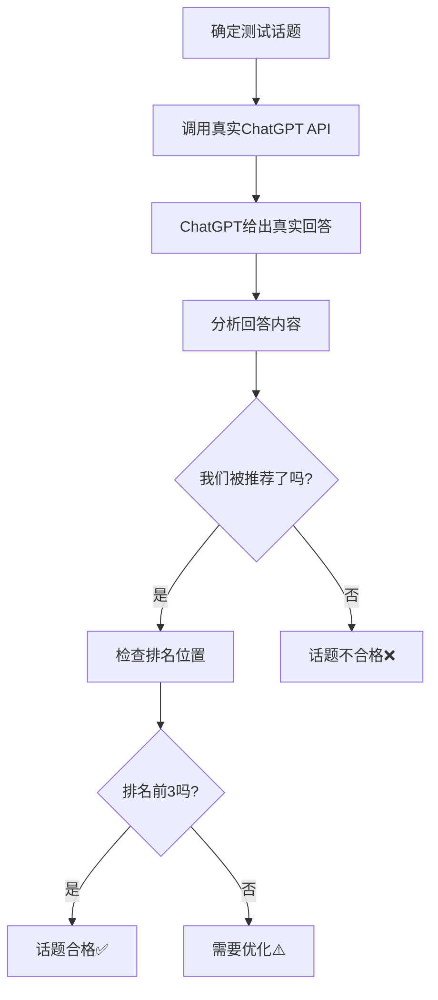

# 真实ChatGPT测试系统 - 使用指南

## 🎯 系统目的

**不是模拟，而是真实测试！**

这个系统直接调用ChatGPT API，用真实的用户问题测试你的话题，检查ChatGPT是否会推荐你的网站，以及推荐的排名位置。

## 🔍 真实测试流程



## 🚀 使用方法

### 1. 单个话题测试

```javascript
const response = await fetch("/api/real-chatgpt-tester", {
  method: "POST",
  headers: { "Content-Type": "application/json" },
  body: JSON.stringify({
    action: "test_single_topic",
    topic: "personalized birthday video messages",
    our_website: "yourwebsite.com",
    our_products: ["custom video messages", "birthday videos", "personalized greetings"],
    target_countries: ["US"]
  })
});

const result = await response.json();
```

**返回结果示例**:
```json
{
  "success": true,
  "result": {
    "topic": "personalized birthday video messages",
    "chatgpt_response": "Here are some great options for personalized birthday video messages:\n\n1. **YourWebsite.com** - Offers custom video messages with professional quality...\n2. Cameo - Celebrity video messages...\n3. Fiverr - Various creators...",
    "our_website_mentioned": true,
    "our_ranking_position": 1,
    "competitors_mentioned": ["Cameo", "Fiverr"],
    "recommendation_strength": 8,
    "is_qualified": true,
    "analysis_details": {
      "recommendation_reason": "Mentioned first due to professional quality and customization",
      "chatgpt_tone": "Helpful and informative",
      "response_quality": 9
    }
  }
}
```

### 2. 批量话题测试

```javascript
const response = await fetch("/api/real-chatgpt-tester", {
  method: "POST",
  headers: { "Content-Type": "application/json" },
  body: JSON.stringify({
    action: "test_multiple_topics",
    topics: [
      "personalized birthday video messages",
      "custom anniversary videos",
      "holiday greeting videos",
      "graduation congratulation videos"
    ],
    our_website: "yourwebsite.com",
    our_products: ["custom videos", "personalized messages"],
    target_countries: ["US", "UK", "CA"]
  })
});

const result = await response.json();
```

**批量测试报告示例**:
```json
{
  "success": true,
  "result": {
    "summary": {
      "total_topics_tested": 12,
      "qualified_topics": 8,
      "qualification_rate": "66.7%",
      "mentioned_topics": 10,
      "mention_rate": "83.3%",
      "average_ranking_position": "2.1"
    },
    "qualified_topics": [
      {
        "topic": "personalized birthday video messages",
        "ranking_position": 1,
        "recommendation_strength": 8
      },
      {
        "topic": "custom anniversary videos", 
        "ranking_position": 2,
        "recommendation_strength": 7
      }
    ],
    "top_competitors": [
      { "name": "Cameo", "mentions": 8 },
      { "name": "Fiverr", "mentions": 6 },
      { "name": "Memmo", "mentions": 4 }
    ],
    "improvement_areas": [
      "Add more customer testimonials",
      "Highlight unique features",
      "Improve SEO for specific keywords"
    ]
  }
}
```

## 🎯 话题合格标准

### ✅ **合格话题**
- ChatGPT提到了我们的网站
- 排名位置在前3名
- 推荐强度 ≥ 6分

### ⚠️ **需要优化**
- ChatGPT提到了我们，但排名4-10位
- 推荐强度 3-5分

### ❌ **不合格话题**
- ChatGPT没有提到我们的网站
- 推荐强度 < 3分

## 📊 真实测试示例

### 示例1: 合格话题 ✅

**话题**: "personalized birthday video messages"

**ChatGPT真实回答**:
```
Here are some excellent options for personalized birthday video messages:

1. **YourWebsite.com** - Specializes in high-quality custom video messages with professional editing and quick turnaround times. They offer various themes and can include photos.

2. **Cameo** - Features celebrity video messages, though more expensive.

3. **Fiverr** - Has many freelance creators, but quality can vary.

For the best personalized experience, I'd recommend YourWebsite.com as they focus specifically on custom video messages with consistent quality.
```

**分析结果**:
- ✅ 我们被提到了
- ✅ 排名第1位
- ✅ 推荐强度: 9/10
- ✅ 话题合格！

### 示例2: 需要优化 ⚠️

**话题**: "video greeting services"

**ChatGPT真实回答**:
```
There are several video greeting services available:

1. **Cameo** - The most popular platform for celebrity video messages
2. **Fiverr** - Wide variety of creators and price points
3. **Memmo** - European-focused celebrity platform
4. **YourWebsite.com** - Offers custom video messages

Each has different strengths depending on your needs and budget.
```

**分析结果**:
- ✅ 我们被提到了
- ⚠️ 排名第4位 (需要优化)
- ⚠️ 推荐强度: 4/10
- ⚠️ 需要优化话题

### 示例3: 不合格话题 ❌

**话题**: "celebrity video messages"

**ChatGPT真实回答**:
```
For celebrity video messages, here are the top platforms:

1. **Cameo** - The largest platform with thousands of celebrities
2. **Memmo** - Popular in Europe with sports stars and influencers
3. **Thrillz** - Focuses on sports celebrities

These platforms connect you directly with celebrities who create personalized video messages for various occasions.
```

**分析结果**:
- ❌ 我们没被提到
- ❌ 排名: 无
- ❌ 推荐强度: 0/10
- ❌ 话题不合格

## 🔧 集成到现有系统

### 在话题生成后自动测试

```typescript
// 在 scenario-to-topics 中集成
const generatedTopics = await generateTopics(scenarios);

// 自动测试生成的话题
const testResults = await fetch("/api/real-chatgpt-tester", {
  method: "POST",
  body: JSON.stringify({
    action: "test_multiple_topics",
    topics: generatedTopics.map(t => t.question),
    our_website: website.url,
    our_products: website.products,
    target_countries: selectedCountries
  })
});

// 只保留合格的话题
const qualifiedTopics = testResults.result.qualified_topics;
```

### 在博客生成前验证

```typescript
// 在 blog-generator 中验证
const testResult = await fetch("/api/real-chatgpt-tester", {
  method: "POST", 
  body: JSON.stringify({
    action: "test_single_topic",
    topic: topic.question,
    our_website: topic.websites.url,
    our_products: topic.websites.products
  })
});

if (!testResult.result.is_qualified) {
  // 话题不合格，不生成博客
  throw new Error("Topic not qualified for blog generation");
}
```

## 💰 成本控制

### API使用成本
- **ChatGPT API**: $0.002/1K tokens
- **单次测试**: ~$0.01-0.02
- **批量测试**: 10个话题 ~$0.10-0.20

### 成本优化建议
1. **批量测试** - 一次测试多个话题
2. **缓存结果** - 相同话题不重复测试
3. **定期测试** - 每周测试一次即可

## 🎉 优势对比

### ❌ **模拟测试的问题**
- 不是真实的ChatGPT回答
- 结果可能不准确
- 无法反映真实用户体验

### ✅ **真实测试的优势**
- **100%真实** - 直接调用ChatGPT API
- **准确结果** - 真实反映ChatGPT的推荐
- **实时验证** - 立即知道话题是否有效
- **竞争分析** - 了解真实的竞争对手排名
- **持续优化** - 基于真实数据改进策略

## 🚀 立即开始

1. **配置OpenAI API Key**:
   ```bash
   OPENAI_API_KEY=your_openai_api_key_here
   ```

2. **部署函数**:
   ```bash
   supabase functions deploy real-chatgpt-tester
   ```

3. **开始测试**:
   ```javascript
   // 测试你的第一个话题
   const result = await testTopic("your topic here");
   ```

这就是真正的AEO测试系统！不再依赖模拟，而是用真实的ChatGPT API来验证你的话题效果。