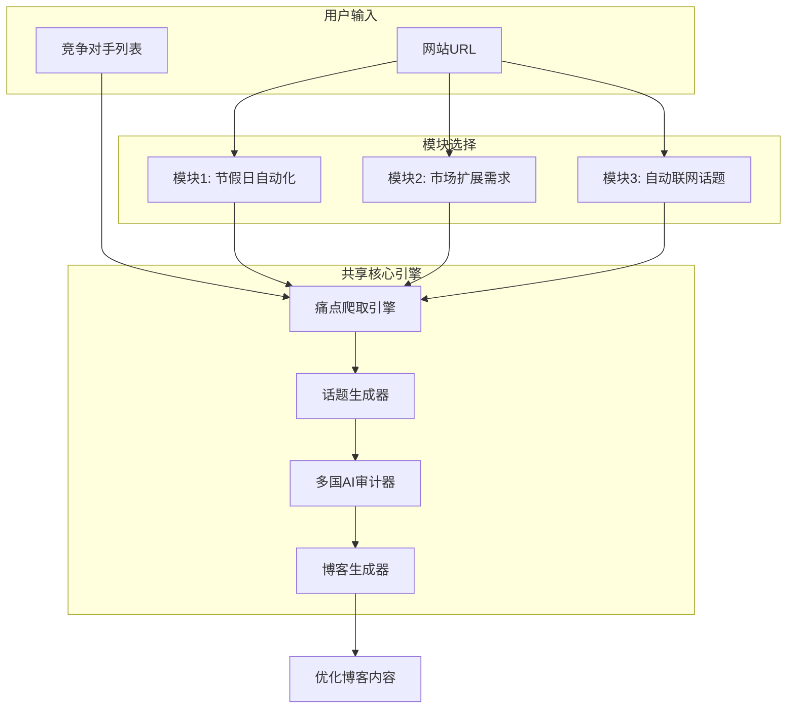
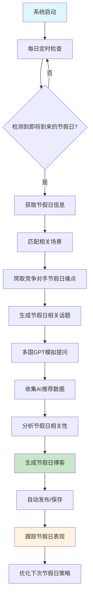
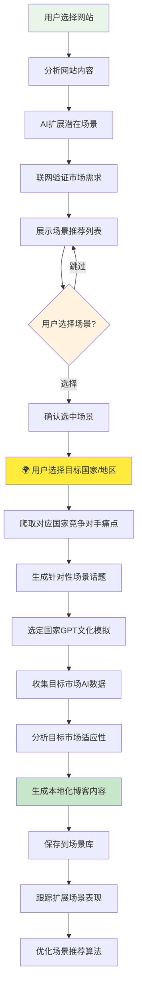
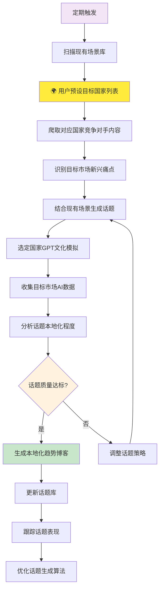
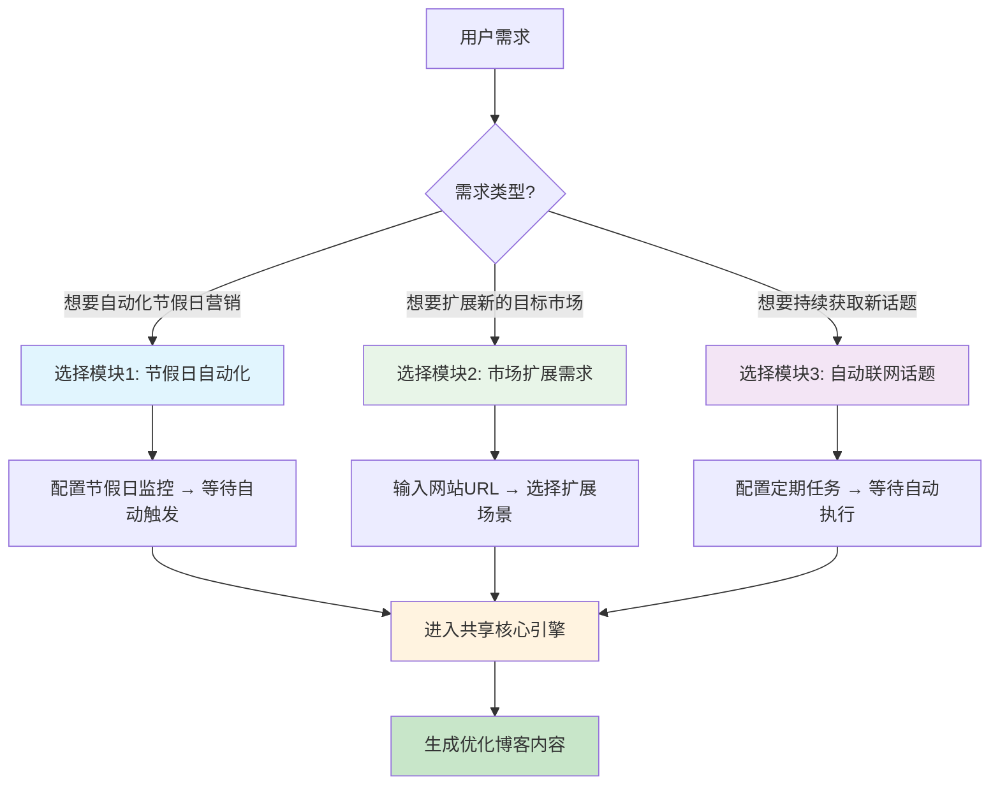
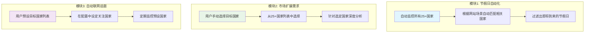
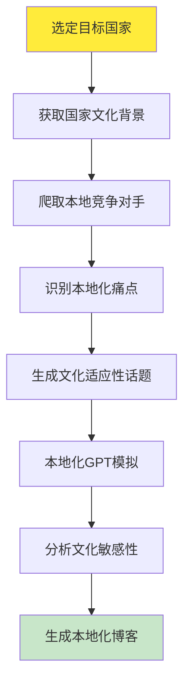

# 三模块系统架构图

## 🎯 系统总览



---

## 📋 模块1：节假日自动化模块

### 🎄 触发方式：时间驱动（自动）



### 📊 模块1详细步骤

| 步骤 | 操作 | 输入 | 输出 | 负责组件 |
|------|------|------|------|----------|
| 1 | 节假日监控 | 当前日期 | 即将到来的节假日列表 | `holiday-monitor` |
| 2 | 场景匹配 | 节假日信息 + 网站场景 | 相关场景列表 | `holiday-content-generator` |
| 3 | 痛点爬取 | 竞争对手 + 节假日关键词 | 节假日相关痛点 | 痛点爬取引擎 |
| 4 | 话题生成 | 痛点 + 节假日场景 | 节假日话题列表 | `scenario-to-topics` |
| 5 | AI测试 | 话题 + 25国文化背景 | AI推荐结果 | `multi-country-ai-auditor` |
| 6 | 博客生成 | AI结果 + 节假日信息 | 优化博客内容 | `blog-generator` |
| 7 | 性能跟踪 | 博客表现数据 | 优化建议 | `holiday_content_performance` |

---

## 🌍 模块2：市场扩展需求模块

### 🎯 触发方式：用户驱动（手动）



### 📊 模块2详细步骤

| 步骤 | 操作 | 输入 | 输出 | 负责组件 |
|------|------|------|------|----------|
| 1 | 网站分析 | 网站URL | 网站内容分析 | 网站分析器 |
| 2 | 场景扩展 | 网站分析结果 | 潜在场景列表 | `scenario-expander` |
| 3 | 市场验证 | 场景 + 搜索关键词 | 市场需求验证 | `market-validator` |
| 4 | 用户选择场景 | 验证后的场景列表 | 用户确认的场景 | `ScenarioSelectionDialog` |
| **5** | **🌍 用户选择国家** | **25+国家列表** | **目标国家/地区** | **国家选择器** |
| 6 | 痛点爬取 | 竞争对手 + 目标国家 | 本地化痛点 | 痛点爬取引擎 |
| 7 | 话题生成 | 痛点 + 扩展场景 | 本地化话题列表 | `scenario-to-topics` |
| 8 | AI测试 | 话题 + 目标国家文化 | 本地化AI结果 | `multi-country-ai-auditor` |
| 9 | 博客生成 | AI结果 + 场景信息 | 本地化博客内容 | `blog-generator` |
| 10 | 场景优化 | 场景表现数据 | 优化建议 | `scenario-optimizer` |

---

## 🔍 模块3：自动联网话题获取模块

### ⚡ 触发方式：定期驱动（自动）



### 📊 模块3详细步骤

| 步骤 | 操作 | 输入 | 输出 | 负责组件 |
|------|------|------|------|----------|
| 1 | 定期扫描 | 定时器触发 | 扫描任务列表 | 定时调度器 |
| 2 | 场景获取 | 网站ID | 现有场景列表 | 场景数据库 |
| **3** | **🌍 获取目标国家** | **用户预设配置** | **目标国家列表** | **配置管理器** |
| 4 | 内容爬取 | 竞争对手 + 目标国家 | 本地化最新痛点 | 痛点爬取引擎 |
| 5 | 趋势分析 | 历史痛点 + 新痛点 | 本地化趋势分析 | 趋势分析器 |
| 6 | 话题生成 | 趋势 + 现有场景 | 本地化话题列表 | `scenario-to-topics` |
| 7 | AI测试 | 话题 + 目标国家文化 | 本地化AI结果 | `multi-country-ai-auditor` |
| 8 | 质量评估 | AI结果 + 历史数据 | 话题质量分数 | 质量评估器 |
| 9 | 博客生成 | 高质量话题 + AI结果 | 本地化博客内容 | `blog-generator` |
| 10 | 算法优化 | 话题表现数据 | 优化参数 | 算法优化器 |

---

## 🔧 共享核心组件详解

### 1. 痛点爬取引擎
```javascript
// 统一的痛点爬取接口
const painPointCrawler = {
  input: {
    competitors: ["competitor1.com", "competitor2.com"],
    keywords: ["节假日关键词", "场景关键词", "趋势关键词"],
    context: "节假日/扩展场景/趋势分析"
  },
  output: {
    painPoints: ["痛点1", "痛点2", "痛点3"],
    opportunities: ["机会1", "机会2"],
    trends: ["趋势1", "趋势2"]
  }
}
```

### 2. 多国AI审计器
```javascript
// 25+国家文化适应性测试
const multiCountryAuditor = {
  countries: ["US", "UK", "DE", "FR", "JP", "KR", "IL", ...],
  testProcess: {
    step1: "生成文化适应性问题",
    step2: "模拟各国用户提问",
    step3: "收集AI回答",
    step4: "分析推荐强度",
    step5: "评估文化敏感性"
  }
}
```

### 3. 博客生成器
```javascript
// 统一的博客生成逻辑
const blogGenerator = {
  input: {
    aiResults: "AI审计结果",
    painPoints: "竞争对手痛点",
    context: "节假日/场景/趋势信息"
  },
  process: {
    step1: "分析AI推荐强度",
    step2: "结合痛点优化内容",
    step3: "适应文化背景",
    step4: "SEO优化",
    step5: "生成最终博客"
  }
}
```

---

## 🎯 模块选择决策树



---

## 🌍 国家选择机制详解

### 三种不同的国家选择策略



### 🎄 模块1：智能国家匹配
- **策略**：自动化 + 智能匹配
- **逻辑**：
  ```javascript
  // 根据网站场景自动匹配相关国家
  const autoMatchCountries = (websiteScenarios, upcomingHolidays) => {
    return upcomingHolidays.filter(holiday => 
      websiteScenarios.some(scenario => 
        scenario.cultural_relevance.includes(holiday.country_code) &&
        scenario.emotional_trigger.includes(holiday.category)
      )
    );
  }
  ```
- **优势**：完全自动化，无需人工干预
- **适用**：已有明确场景数据的网站

### 🌍 模块2：用户主导选择
- **策略**：用户手动选择 + 深度定制
- **界面**：
  ```javascript
  // 国家选择界面
  const CountrySelector = {
    regions: {
      "北美": ["US", "CA"],
      "欧洲": ["UK", "DE", "FR", "IT", "ES", "NL", ...],
      "亚洲": ["JP", "KR", "IL"],
      "大洋洲": ["AU", "NZ"]
    },
    multiSelect: true,
    culturalInfo: true, // 显示文化背景信息
    marketData: true    // 显示市场数据
  }
  ```
- **优势**：精准定位，深度本地化
- **适用**：明确目标市场的扩展需求

### 🔍 模块3：预设配置管理
- **策略**：一次配置 + 持续监控
- **配置**：
  ```javascript
  // 用户预设配置
  const targetCountriesConfig = {
    primary: ["US", "UK", "DE"],      // 主要市场
    secondary: ["FR", "IT", "ES"],    // 次要市场
    experimental: ["JP", "KR"],       // 实验市场
    monitoring_frequency: "daily",
    content_priority: "primary_first"
  }
  ```
- **优势**：持续优化，自动执行
- **适用**：长期内容策略规划

---

## 🎯 本地化内容生成流程

### 选择国家后的处理流程



### 文化适应性处理

```javascript
// 针对不同国家的文化适应性处理
const culturalAdaptation = {
  "US": {
    communication_style: "direct, enthusiastic",
    cultural_values: ["individualism", "achievement", "optimism"],
    content_tone: "confident, solution-oriented",
    avoid_topics: ["politics", "religion"]
  },
  "JP": {
    communication_style: "indirect, respectful",
    cultural_values: ["harmony", "respect", "tradition"],
    content_tone: "polite, humble, detailed",
    avoid_topics: ["direct criticism", "personal failure"]
  },
  "DE": {
    communication_style: "direct, factual",
    cultural_values: ["efficiency", "quality", "precision"],
    content_tone: "professional, detailed, logical",
    avoid_topics: ["superficial claims", "emotional appeals"]
  }
  // ... 其他23个国家
}
```

---

## 📈 数据流向总结

所有三个模块最终都会：
1. **爬取痛点** → 获取竞争对手相关痛点
2. **生成话题** → 基于痛点和场景生成测试话题
3. **AI测试** → 25+国家多文化GPT模拟提问
4. **收集数据** → 分析AI推荐强度和文化适应性
5. **生成博客** → 基于AI结果生成优化的SEO博客内容
6. **跟踪优化** → 监控表现并持续优化算法

这就是完整的三模块系统架构！每个模块都有明确的触发方式和处理流程，但最终都通过相同的核心引擎来保证内容质量的一致性。